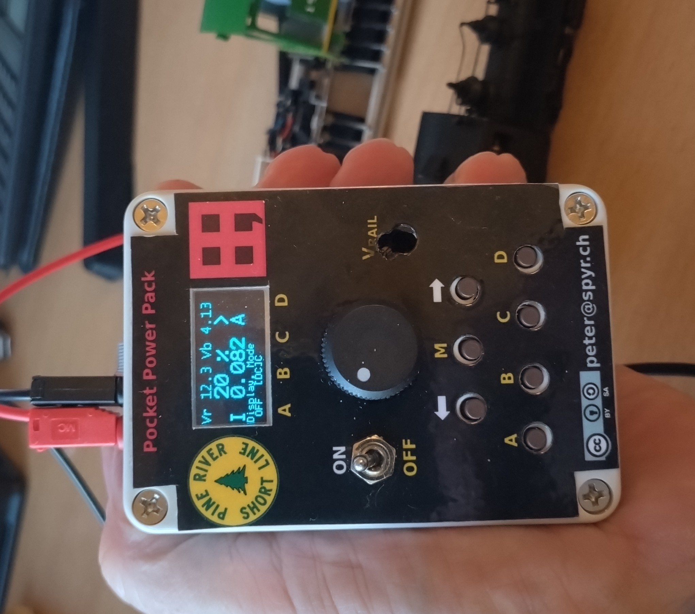
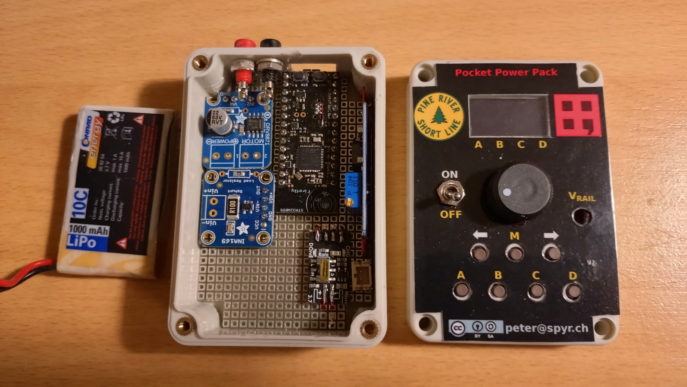
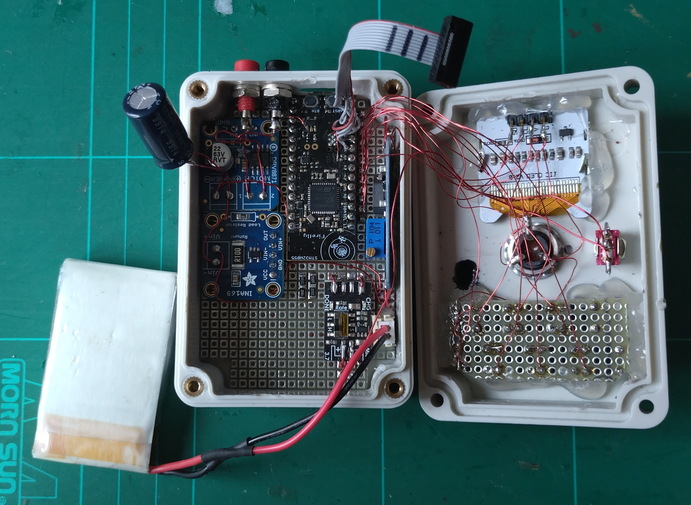
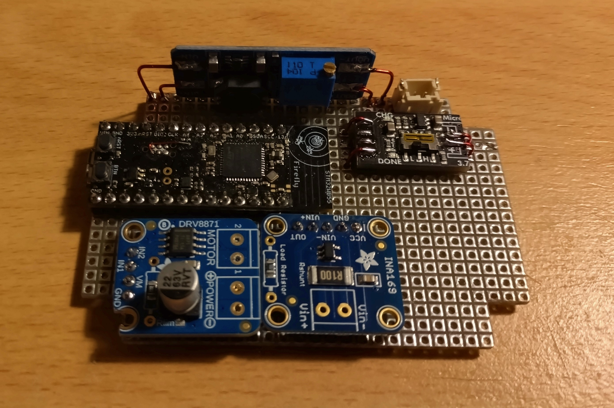

# Pocket Power Pack (Mecrisp-Cube ppp branch)

Model railroading on the go. A battery operated power pack gives you the opportunity to take your model railroad with you. 
No mess with outlets and cables. Build your Pocket Power Pack, get some sectional track, a locomotive (DCC or DC) and a few cars and you are in business.

From the DCC point of view the Pocket Power Pack combines _Throttle_, _Command Station_, and _Booster_ in the same hand held unit. 
No power supply is required as long as the battery lasts. You can recharge the battery with a standard smart phone charger.

Also featured in HACKADAY [Pocket Power Pack](https://hackaday.io/project/196655-4th-calculator).

 

## Features

### DC-Mode
 - Max. current 0.5 A (limited by the DCDC-converter Purecrea MT3608)
 - Short circuit proof
 - Adjustable rail voltage between 5 V and 20 V
 - Display shows
   - PWM duty cycle 0 .. 100 %
   - Direction
   - Current consumption
   - Rail voltage
   - Battery voltage
   - Menu
 - PWM frequencies: 250 Hz, 500 Hz, 1 kHz, 2 kHz, 4 kHz, 8 kHz, and 16 kHz
 - Brake mode (fast/slow [decay mode](https://learn.adafruit.com/improve-brushed-dc-motor-performance/current-decay-mode))
 - With 1000 mA LiPo battery
   - Operating time
     - Small HOe or N-scale locomotive (50 mA): 5 h 
     - Small HO locomotive (100 mA): 2.5 h
     - Medium HO locomotive (250 mA): 1 h
   - Charging time about 2 h (micro USB charger, 500 mA)

### DCC-Mode
Not implemented yet.
 - 4 locomotive slots (address range 0 .. 9999)
 - Speed 0 .. 127
 - Direction
 - Light (F0), bell (F1), airhorn (F2), mute (F8)
 - 8 programmable functions (F0 .. F28)
   
### Bluetooth Remote Control
  - Use your smart phone as a additional remote throttle
  - DCC-EX commands over BLE
  - DCC++Throttle


## How to Use the Pocket Power Pack
It could not be simpler. Connect the power to the rails and turn the knob. 
Change direction with the arrow buttons. 
Choose the menu line with the M button, select the option with the button A, B, C, or D.

## About Forth (For Developers)
Forth is an interactive and extensible language, with built-in lexical analysis 
(tokenizer, parser) and interpreter/compiler, needs less than 20 KiB Flash and 
4 KiB RAM, unbelievable for a self-contained (self-hosted) system. 

Forth is perfect for embedded systems where some sort of user interactivity 
like CLI and extensibility (at runtime) are needed. 

C & Forth in the 21st Century. C and Forth are both about 50 years old. 
The combination of the strength of this two worlds results in a powerful 
system that outperforms other much newer systems like Python. 
Good design withstands the test of time.

The goal of Mecrisp-Cube is to be a complete Forth programming environment 
for STM32 MCUs. There are three flavors (branches) available:

  * [STM32WB55](../master) (`master` branch) for the _STM32WB55 Nucleo Board_ and _dongle_ and variants for the
    [Firefly Dev Board](../firefly) (`firefly`), [Katydid Dev Board](../katydid) (`katydid`),
    [WB5M Discovery](../WB5M) (`WB55M`) and the [STM32WB Feather](../WBfeather) (`WBfeather`).
    In work [Flipper Zero](../Flipper) (`Flipper`):
  * [STM32F405](../F405) (`F405`) for Adafruit's Feather STM32F405.
  * [STM32H74x](../H743) (`H743`) for STM NUCLEO-H743ZI and Arduino Portenta H7 Development Board.

May the Forth Be With You!


## Intro for the Firefly STM32WB55 Board (For Developers)

Unfortunately the STM32WB Feather Development Board is no longer available. 
But there is a very good substitute the Firefly designed by Tlera Corp. The pinout is very 
similar to Arduino UNO but with the size of an Arduino Nano (or a Teensy). 

The GPIOs are very carefully selected. JTAG SWD is on the pin header too!

Firefly BLE STM32WB55 Development Board on 
[tindie](https://www.tindie.com/products/tleracorp/firefly-ble-stm32wb55-development-board/)


There is an [Arduino Core](https://github.com/GrumpyOldPizza/ArduinoCore-stm32wb) for this board
but I prefer Forth.

Instant real-time programming with Forth. 

### Minor Design Flaws

#### USB Supply


If you draw more than a few millimaps from the USB the VUSB voltage drops to 4.5 V 
and the VDDUSB drops below 3 V. Quote Datasheet STM32WB55xx

> VDDUSB = 3.0 to 3.6 V: external independent power supply for USB transceivers.

To use a voltage divider for VBUS sensing detection is OK but not for supply the USB peripheral. 
For more details see AN4879 chapter 2.7.

I propose to remove the resistors R1 and R2 (voltage/resistor divider) and connect the VDDUSB 
direct to the 3V3 supply. 


#### VBAT

VBAT pin is a supply pin for batteries or super caps and not well suited as an ADC input.
It uses an internal 3:1 voltage divider. This divider consist of three internal 30 kOhm resitors.
If you source this pin with the 100 k / 27 k the result can't be accurate. 

I propose to connect VBAT with an ADC input.


#### Driving Current for LSE (32.768 kHz Quartz)

With LSE Drive set to minimum, the LSE (32.768 kHz Quartz) do not start reliable. 
If the LSE does not start, the CPU2 will not start either and BLE will not work.

Set LSE drive at least to medium low. 

### Board Support Package [BSP](/sdcard/man/BoardSupportPackage.md)

  * 1 push button
  * 1 LED
  * 14 GPIO pins, D0 .. D13
  * 5 ADC pins, A0 .. A4; internal VBAT and VREF (VDD), chip temperature
  * I2C
  * SPI
  * 3 PWM pins
  * Input Capture / Output Compare
  * 4 external interrupts (EXTI)

For more BSP details see [BoardSupportPackage](/sdcard/man/BoardSupportPackage.md).


## Getting Started

These instructions will get you a copy of the project up and running on your local 
machine (Pocket Power Pack, Firefly Dev Board) for development and testing purposes. 


### Prerequisites
 
  * Firefly BLE STM32WB55 Development Board available from [tindie](https://www.tindie.com/products/tleracorp/firefly-ble-stm32wb55-development-board/), $30
  * Perfboard square grid of 0.1 inches, pads on both sides (plate-through holes), 3" x 2", $3
  * OLED display 128x64 pixels, SSD1306, [Octopus PIS-1277](https://www.digikey.ch/de/products/detail/pi-supply/PIS-1277/10315759), [Grove - OLED Display 0.96"](https://www.seeedstudio.com/Grove-OLED-Display-0-96-SSD1315-p-4294.html), $5
  * 7 pcs push buttons, fit in 0.4" grid
    * Würth 430473035826, DigiKey #732-7021-1-ND, data sheet, $0.5
    * TE Connectivity ALCOSWITCH Switches 1825910-6, $0.15
    * C&K PTS 647 SN50 SMTR2 LFS, DigiKey #PTS647SN50SMTR2LFSCT-ND, smaller 4.5 x 4.5 mm, $0.2
  * LiPo battery e.g. [Lithium Ion Polymer Battery - 3.7v 1200mAh](https://www.adafruit.com/product/258), [Reely 1000 mAh](https://www.conrad.ch/de/p/reely-modellbau-akkupack-lipo-3-7-v-1000-mah-zellen-zahl-1-30-c-bec-2582341.html), $10
  * USB Charger, [Adafruit Micro Lipo - USB LiIon/LiPoly charger](https://www.adafruit.com/product/1304), $6
  * DCDC Converter, Purecrea MT3608, $5
  * Current Sensor, [INA169 Analog DC Current Sensor Breakout](https://www.adafruit.com/product/1164), $10
  * Motor Driver, [DRV8871 DC Motor Driver Breakout ](https://www.adafruit.com/product/3190), $8
  * Hot glue or double sided mounting tape e.g. Tesa 55750
  * Laminating machine (optional) 
  * [STM32CubeProgrammer](https://www.st.com/en/development-tools/stm32cubeprog.html)
  * Case e.g. [Modulgehäuse Sintron #207328](https://sintron-shop.de/produkte/bauelemente-gehaeuse-zubehoer/gehaeuse/21/modulgehaeuse-abs-83x58x33-mm-ip65) ABS 83x58x33 mm IP65, mit transparentem Deckel #207885.
  * Potentiometer e.g. [Knob Potentiometer](https://www.vishay.com/docs/51036/p16pa16.pdf)
  * Micro switch

 

For developers:
  * Terminal emulator application for PC, e.g.:
    * [tio](https://github.com/tio/tio), my favourite - Windows and Linux 
    * [PuTTY](http://www.putty.org/) - Windows and Linux
    * [Tera Term](http://en.sourceforge.jp/projects/ttssh2/) - Windows
    * [Realterm](http://realterm.sourceforge.net/) - Windows
    * minicom, microcom, screen - Linux
    * for details see [Terminal-IO](/sdcard/man/TerminalIO.md)
  * 10 pin JTAG/SDW cable
  * STLINK-V3 compact in-circuit debugger and programmer for STM32
  * Integrated Development Environment for STM32 [STM32CubeIDE](https://www.st.com/en/development-tools/stm32cubeide.html)  

### Build the Hardware

 


#### Schematic 
[kicad schematic](sdcard/man/kicad/pocket_power_pack/pocket_power_pack.kicad_sch)
 

#### Cut the perfboard for the Base Board
Cut the perfboard to 3" x 2" (76.5 x 51.5 mm) dimension or 30 x 20 pads. Cut out corners (3 x 3 1/10"),
 

#### Cut the perfboard for the Key Board, Solder and Wire Push Buttons
Solder the 7 push buttons to the perfboard. Each button is in the middle of 4 x 3 pads, the grid is 0.4".
Wire the buttons.

#### Mount the Firefly SBC
Solder the Firefly to the perfboard. 

#### Mount USB Charger
Solder the Adafruit Micro-Lipo Charger to the perfboard. 
I shortened the board on the USB end and on the battery connector end.
If the battery has a JST connector, no wiring/solderin is required.

#### Mount the DCDC Converter
The DCDC coinverter stays on the long edge on base board. 
You can use wires to connect and fix the PCB to the base board.

#### Mount the Current Sensor
Remove the screw terminal.

#### Mount the Motor Driver
Remove the screw terminals. Capacitor

#### Wire the buttons to the SBC
Wire the button rows and columns to the dongle.

|*Description*|*Dongle*|*Function* | *Pocket Power Pack* |
|-------------|--------|-----------|--------------|
| PB3         | CN1.5  | SWO       | ROW0         |
| PB2         | CN1.7  |           | ROW1         |
| PA6         | CN1.9  | D12       | ROW2         |
| PA7         | CN1.10 | D11       | ROW3         |
| PB6         | CN2.6  | UARTRX    | ROW4         |
| PA9         | CN2.7  | D9        | ROW5         |
| PA8         | CN2.8  | D6        | ROW6         |
| PA0         | CN2.3  | A3        | COL0         |
| PA1         | CN2.10 | A2        | COL1         |
| PA2         | CN2.4  | D1        | COL2         |
| PA3         | CN2.5  | D0        | COL3         |
| PA5         | CN1.8  | D13       | COL4         |

#### Wire the JTAG SWD (optional)
Only needed if you want to debug the board.

|*Description*|*Dongle*|*Function* | *JTAG 10pin* |
|-------------|--------|-----------|--------------|
| GND         | CN1.1  | GND       |  3, 5, 9     |
| NRST        | CN1.2  | RES       |  10          |
| PA13        | CN1.3  | SWDIO     |  2           |
| PA14        | CN1.4  | SWDCLK    |  4           |
| 3V3         | CN1.6  | 3V3       |  1           |


#### Place the Resistors

#### Mount the OLED Display
Glue the OLED Display to the underside .

#### Wire the OLED
|*Description*|*Dongle*|*Function* | *OLED*       |
|-------------|--------|-----------|--------------|
| GND         | CN1.1  | GND       | GND          |
| 3V3         | CN1.6  | 3V3       | VCC          |
| PB8         | CN2.1  | D15 SCL   | SCL          |
| PB9         | CN2.2  | D14 SDA   | SDA          |


#### Overlay

<table>
  <tr>
    <td>
 </td>
    <td></td>
  </tr>
</table> 

1. Print the keyboard overlay on heavy weight white paper
2. Cut out the overlay
3. Laminate the overlay
4. Cut out the laminated overlay
5. Cut holes for the push buttons, I use a leather puncher (4 mm holes)


#### Flash the PPP Firmware

Flash the Pocket Power Pack [binary](/sdcard/boot/MecrispCubeCalcFS.bin) `MecrispCubeCalcFS.bin` to the WB55 Nucleo dongle. Using the built-in USB DFU bootloader.

The USB Dongle does not have a ST-Link interface, but the STM32WB has a built-in 
boot-loader. This bootloader works via USB. As programming tool I use the 
the [STM32CubeProgrammer](https://www.st.com/en/development-tools/stm32cubeprog.html) package. 

1. For programming the switch SW2 has to be in position BOOT0.
2. Connect the dongle USB with the computer.
3. Flash the firmware with STM32CubeProgrammer, either with the CLI (see below) or the GUI (open file .., Download)
4. Disconnect dongle from the computer.
5. Set the switch SW2 to position 0.

<pre>
$ <b>alias cubepgmcli='/opt/STMicroelectronics/STM32Cube/STM32CubeProgrammer/bin/STM32_Programmer_CLI'</b>
$ <b>cubepgmcli -c port=USB1 -d MecrispCubeCalcFS.bin 0x8000000 </b>
</pre>

#### Update BLE Stack (optional)

You can find the BLE Stack and FUS in 
[STM32CubeWB](https://www.st.com/en/embedded-software/stm32cubewb.html)
or from [GitHub](https://github.com/STMicroelectronics/STM32CubeWB), 
in the directory `Projects/STM32WB_Copro_Wireless_Binaries`. 
At time of writing the FUS is Version 1.2.0, the stack v1.19.1. The STM32CubeProgrammer is v2.16.0.

1. For programming the switch SW2 has to be in position BOOT0.
2. Connect the dongle USB with the computer.
3. Flash the firmware with STM32CubeProgrammer, either with the CLI (see below) or the GUI (use the firmware upgrade service, start address usually 0x080CE000)
4. Disconnect dongle from the computer.
5. Set the switch SW2 to position 0.

<pre>
$ <b>alias cubepgmcli='/opt/STMicroelectronics/STM32Cube/STM32CubeProgrammer/bin/STM32_Programmer_CLI'</b>
$ <b>cd STM32Cube_FW_WB_V1.19.1/Projects/STM32WB_Copro_Wireless_Binaries/STM32WB5x</b>
$ <b>cubepgmcli -c port=USB1 -fwupgrade stm32wb5x_BLE_Stack_full_fw.bin 0x080CE000 firstinstall=0</b>
</pre>


### Use the Terminal (USB CDC)

Connect the WB55 Dongle USB to the PC. Start the terminal emulator application on the PC. 
Check for the serial communication port (e.g. for Linux `/dev/ttyACM0`).
With `tio` you can list available devices, look for 4TH devices
```
$ tio -l
Device            TID     Uptime [s] Driver           Description
----------------- ---- ------------- ---------------- --------------------------
/dev/ttyACM0      38E5      8567.913 cdc_acm          ST-Link VCP Ctrl
/dev/ttyACM1      PESx       873.742 cdc_acm          4TH CDC

By-id
--------------------------------------------------------------------------------
/dev/serial/by-id/usb-spyr.ch_4TH_PPP_43003F0013504D5943373420-if00
/dev/serial/by-id/usb-STMicroelectronics_STLINK-V3_002700073156501320323443-if02

By-path
--------------------------------------------------------------------------------
/dev/serial/by-path/pci-0000:00:14.0-usb-0:2:1.0
/dev/serial/by-path/pci-0000:00:14.0-usb-0:1:1.2
```

I set the terminal configuration (e.g. putty) to 

  * Implicit CR in every LF 
  * Local echo: off
  * Local line editing: off
  * Keyboard Backspace: Control-H
  * Keyboard Function: Keys VT100
  * Remote character set: CP850

With `tio`
```
tio --map ICRNL,INLCRNL /dev/serial/by-id/usb-spyr.ch_4TH_PPP_43003F0013504D5943373420-if00 
```

The greeting screen should apear after pushing the <kbd>**TERM**</kbd> button on the Pocket Power Pack:
```
Pocket Power Pack
-----------------
Mecrisp-Cube 1.6.0 deb for STM32WB Nucleo, 63/128 KiB RAM/FLASH dictionary (C) 2024 peter@spyr.ch
  * Mecrisp-Stellaris RA 2.5.4 by Matthias Koch. 
  * Firmware Package STM32Cube FW_WB V1.17.3, BLE Stack 5.3 (C) 2023 STMicroelectronics 
  * CMSIS-RTOS V2 FreeRTOS wrapper, FreeRTOS Kernel V10.3.1 (C) 2020 Amazon.com
  * FatFs for internal flash and microSD - Generic FAT fs module  R0.12c (C) 2017 ChaN
  * tiny vi - part of BusyBox (C) 2000, 2001 Sterling Huxley
  * TinyUSB CDC, MSC v0.16.0 (C) 2023, hathach (tinyusb.org)
```
Use the interpreter ([reverse polnish notation](https://en.wikipedia.org/wiki/Reverse_Polish_notation), like HP calculators):
```
23 5 / .
```
This looks like this on your terminal (**bold** is the Forth answer):
<pre>
23 5 / .[CR] <b>4  ok.</b>
</pre>
The `ok.` is the Forth prompt and apears at the end of the line (Forth does it differently, like most things ;-). 
If you don't like it, [change it](/sdcard/man/FileSystem.md#shell-prompt). 
`[CR]` is the Enter-key.

Type in your first Forth program (create a word in the RAM dictionray):
```
: hello ." World" ;
```
and execute the the program
```
hello 
```
again the terminal output:
<pre>
: hello ." World" ;[CR]  <b>ok.</b>
hello[CR] <b>World ok.</b>
</pre>
The program `hello` ist not persistent, after power cycle or even reset the RAM dictionray is erased. 
But it is easy to add a word to the Flash dictionray:
```
compiletoflash
: hello ." World" ;
```
The program source is not saved, only the executable machine code is compiled into the flash. 
You can use the built-in editor [vi](/sdcard/man/EditorVi.md) and save your source to the 
[filesystem](/sdcard/man/FileSystem.md) either on internal flash drive `0:` or on the microSD card drive `1:`.

The following part is only for people who are interested how Forth works and have knowledge about 
the ARM Assembler.
There is a built-in disassembler (consider the machine code `B500` is 16 bit hex number, but it is stored 
as `00` `B5`):
```
see hello
08043558: B500  push { lr }
0804355A: F7BF  bl  08002BE4  -->  .' World'
0804355C: FB43
0804355E: 5705
08043560: 726F
08043562: 646C
08043564: BD00  pop { pc }
```
The dictionray entry looks like this (you can see the 'hello' and the string constant 'World'):
```
$08043558 10 dump
08043550 :  00 00 05 68 65 6C 6C 6F   00 B5 BF F7 43 FB 05 57  | ...hello  ....C..W |
08043560 :  6F 72 6C 64 00 BD 00 00   FF FF FF FF FF FF FF FF  | orld....  ........ |
```
The compiled word `hello` needs only 14 bytes in the dictionary.

### Buttons, LED

#### Special Functions on Startup 

  * *SW1* do not include `0:/etc/rc.local` on startup


#### LEDs as Status Indicator

The LEDs on the dongle displays the status
  * *Green* USB enumerated
  * *Red* Error occured
  * *Blue* BLE connected


## Installing Development Environment 

A step by step series of examples that tell you how to get a development env running

Install the IDE [STM32CubeIDE](https://www.st.com/en/development-tools/stm32cubeide.html), 
it is Eclipse and GCC based. 
[STM32CubeMX](https://www.st.com/en/development-tools/stm32cubemx.html)
is included in the IDE, you need a stand alone installation only if 
you do not want to use the STM32CubeIDE.  

Get the sources from github:

```
psi@homer:~> git clone https://github.com/spyren/Mecrisp-Cube
Cloning into 'Mecrisp-Cube'...
remote: Enumerating objects: 8334, done.
remote: Counting objects: 100% (2220/2220), done.
remote: Compressing objects: 100% (860/860), done.
remote: Total 8334 (delta 1458), reused 2059 (delta 1335), pack-reused 6114
Receiving objects: 100% (8334/8334), 108.93 MiB | 13.49 MiB/s, done.
Resolving deltas: 100% (5788/5788), done.
psi@homer:~> git checkout ppp 
```

Import the project into the IDE:

```
File -> Import -> General -> Existing Projects into Workspace -> Select root directory
Copy project into workspace
Browse to Mecrisp-Cube directory
```

Generate code from the STM32CubeMX `MecrispCubeCalc.ioc` file:

```
Project -> Generate Code 
```

Restore changed source files
```
$ git status
{list of changed files}
$ git restore {files to restore} 
```
alternative
```
$ git stash
```

Select the Build Configuration (Debug if you want to debug the project) and Build the project:

```
Project -> Build Configurations -> Set Active -> Debug/Release 
Project -> Build Project
```

## How it Works

## Built With

* [STM32CubeIDE](https://www.st.com/en/development-tools/stm32cubeide.html) - 
  STM32CubeIDE is an all-in-one multi-OS development tool, 
  which is part of the STM32Cube software ecosystem. The IDE is used for 
  development, GCC tools are included.
* [STM32CubeMX](https://www.st.com/en/development-tools/stm32cubemx.html) - 
  STM32CubeMX is a graphical tool that allows a very easy configuration of 
  STM32 microcontrollers and microprocessors, as well as the generation of 
  the corresponding initialization C code for the Arm® Cortex®-M core or a 
  partial Linux® Device Tree for Arm® Cortex®-A core), through a step-by-step process. 
* [STM32CubeProg](https://www.st.com/en/development-tools/stm32cubeprog.html) - 
  STM32CubeProgrammer (STM32CubeProg) is an all-in-one multi-OS software 
  tool for programming STM32 products. 

The STM tools work on Linux, Windows, and Mac.

Tab size is 4 for C and assembler source files. 
Append `?ts=4` to the URL to change the tab-size.


## Authors

* **Peter Schmid** - *Initial work* - [Mecrisp Cube](https://spyr.ch/twiki/bin/view/MecrispCube)
* **Matthias Koch** - *Forth on ARM Cortex M0/M4* - [Mecrisp Stellaris](http://mecrisp.sourceforge.net/)


## License

This project *Pocket Power Pack* is free software: you can redistribute it
and/or modify it under the terms of the GNU General Public License as
published by the Free Software Foundation, either version 3 of the
License, or (at your option) any later version.

*Pocket Power Pack* is distributed in the hope that it will be useful,
but WITHOUT ANY WARRANTY; without even the implied warranty of
MERCHANTABILITY or FITNESS FOR A PARTICULAR PURPOSE.  See the
GNU General Public License for more details.

You should have received a copy of the GNU General Public License along
with *Pocket Power Pack*. If not, see http://www.gnu.org/licenses/.


## Acknowledgments

* http://mecrisp.sourceforge.net/ Original Mecrisp project, **Matthias Koch**
* https://mecrisp-stellaris-folkdoc.sourceforge.io/ Mecrisp Stellaris Unofficial UserDoc, **Terry Porter**


## Documentation

### Local (Mecrisp-Cube specific)

 * [Words](/sdcard/man/words.md), built-in words
 * [Board Support Package](/sdcard/man/BoardSupportPackage.md), board specific
 * [RTOS](/sdcard/man/CmsisRtos.md), CMSIS real-time OS
 * [Terminal IO](/sdcard/man/TerminalIO.md)
 * [Filesystem](/sdcard/man/FileSystem.md)
 * [VI Editor](/sdcard/man/EditorVi.md)
 * Error Handling ([Assertion](/sdcard/man/assert.md) and [Watchdog](/sdcard/man/watchdog.md))
 * [Real Time Clock](/sdcard/man/RealTimeClock.md)
 * [Floating Point Unit](/sdcard/man/fpu.md)
 * [C API](/sdcard/man/CallingCFunction.md)
 * [Display](/sdcard/man/display.md)


### Elsewhere

 * [Leo Brodie, Starting Forth](https://www.forth.com/starting-forth/) 
 * [Leo Brodie, Thinking Forth](https://thinking-forth.sourceforge.net/)
 * [Learn X in Y minutes](https://learnxinyminutes.com/docs/forth/) Where X=Forth
 * https://forth-ev.de/ Forth-Gesellschaft e.V.
 * https://forth-ev.de/wiki/res/lib/exe/fetch.php/vd-archiv:4d2015-arm.pdf ARM-Sonderheft
 * https://forth-standard.org/standard/words, Forth 2012 Standard Words
 * https://gforth.org/manual/, GForth Manual

### DCC 
  * http://jmri.org
  * https://dccwiki.com
  * https://www.morop.org/index.php/de/nem-normen.html
  * https://github.com/ZIMO-Elektronik/DCC
  * https://normen.railcommunity.de/RCN-211.pdf
  * https://www.opendcc.de/info/dcc/dcc.html
  * https://www.nmra.org/sites/default/files/standards/sandrp/DCC/bulliten_feb_1994_dcc.pdf
  * https://github.com/ZIMO-Elektronik/DCC
  * [DCC-EX](https://dcc-ex.com/index.html#), [commands summary](https://dcc-ex.com/reference/software/command-summary-consolidated.html#gsc.tab=0)

### DCDC Converter
  * TLV61048 14-V Output Voltage Non-synchronous Boost Converter in SOT-23 package
  * TPS61372 16-V, 3.8-A Synchronous Boost With Load Disconnec
  * https://www.ti.com/lit/ds/symlink/lm2577.pdf
  * TPS6128xD/E Low-IQ
  * TPS61087 650-kHz,1.2-MHz, 18.5-V Step-Up DC-DC Converter With 3.2-A Switch
  * XL6009/LM2577
