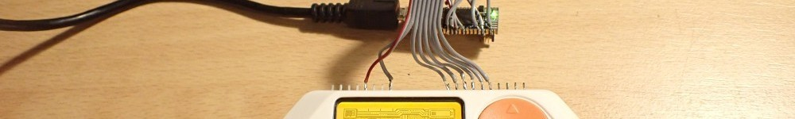

Board Support Package for the Flipper Zero
==========================================

The board support package for the STM32WB Flipper Zero is restricted to the
pin header (Arduino numbering) and the onboard LEDs, switches (buttons), LCD, charger.
The STM32 has much more capabilities than 10 digital I/O pins, 3 analog
input pins, UART, SPI, and I2C interfaces. But if you want to use the
more advanced features you can use the CubeMX to create source code for
the internal peripherals. This project wants to show how to use the Cube
Ecosystem for a Forth system (or vice versa) and can\'t implement all
features and possibilities the STM32WB has. It is a good starting point
for your project. 

Board Support Words
===================

Defaults: Digital port pins D0 to D7 are push pull outputs, D8 to D15
are inputs with pull-up resistors.
```
rgbled!      ( u -- )         set the RGB led ($ff0000 red, $00ff00 green, $0000ff blue)
rgbled@      ( -- u )         get the RGB led ($ff0000 red, $00ff00 green, $0000ff blue)
wled!        ( u -- )         set the W (LCD backlight) led
wled@        ( -- u )         get the W (LCD backlight) led
+sysled      ( flags -- )     set sysled flags $01 ACTIVATE, $02 DISK_READ_OPERATION, $04 DISK_WRITE_OPERATION
                              $08 CHARGING, $10 FULLY_CHARGED, $20 BLE_CONNECTED
-sysled      ( flags -- )     clear sysled flags 

switch1?     ( -- f )         get switch1 (OK button), closed=TRUE
switch2?     ( -- f )         get switch2 (BACK button), closed=TRUE
switch3?     ( -- f )         get switch3 (RIGHT button), closed=TRUE
switch4?     ( -- f )         get switch4 (LEFT), closed=TRUE
switch5?     ( -- f )         get switch5 (UP button), closed=TRUE
switch6?     ( -- f )         get switch6 (DOWN button), closed=TRUE

button       ( -- c )         wait for and fetch the pressed button (similar to the key word) 
                              char b BACK, o OK, r RIGHT, l LEFT, u UP, d DOWN
button?      ( -- f )         Is there a button press?


dport!       ( n -- )         set the digital output port (D0=bit0 .. D15=bit15).
dport@       ( -- n )         get the digital input/output port (D0=bit0 .. D15=bit15).
dpin!        ( n a -- )       set the digital output port pin (D0=0 .. D18=18)
dpin@        ( a -- n )       get the digital input/output port pin 
dmod         ( u a -- )       set the pin mode: 0 in, 1 in pull-up, 2 in pull-down, 3 out push pull, 4 out open drain, 5 out push pull PWM
                                                6 input capture, 7 output compare, 8 I2C, 9 UART, 10 SPI, 11 analog

pwmpin!      ( u a -- )       set the digital output port pin (D6=6, D11=11) to a PWM value (0..1000). Default frequency is 1 kHz, TIMER1
pwmprescale  ( u --  )        set the PWM prescale for TIMER1 (D6=6, D11=11)). 32 kHz / prescale, default 32 -> PWM frequency 1 kHz

EXTImod      ( u a -- )       set for pin a (D0, D6, D9, D10) the EXTI mode u: 0 rising, 1 falling, 2 both edges, 3 none
EXTIwait     ( u a -- )       wait for EXTI interrupt on pin a (D0, D6, D9, D10), timeout u in [ms]

ICOCprescale ( u -- )         set the input capture / output compare prescale for TIMER2. default 32 -> 32 MHz / 32 = 1 MHz, timer resolution 1 us
ICOCperiod!  ( u -- )         set the input capture / output compare (TIMER2) period. default $FFFFFFFF (4'294'967'295). 
                              When the up counter reaches the period, the counter is set to 0. 
                              For prescale 32 the maximum time is about 1 h 11 m
ICOCcount!   ( -- u )         set the input capture / output compare counter for TIMER2
ICOCcount@   ( u -- )         get the input capture / output compare counter for TIMER2
ICOCstart    ( -- )           start the ICOC period
ICOCstop     ( -- )           stop the ICOC period
OCmod        ( u a -- )       set for pin a (D0, D1, D5) the Output Compare mode u: 0 frozen, 1 active level on match, 2 inactive level on match, 
                              3 toggle on match, 4 forced active, 5 forced inactive
    
OCstart      ( u a -- )       start the output compare mode for pin a with pulse u
OCstop       ( a -- )         stop output compare for pin a
ICstart      ( u -- )         start input capture u: 0 rising edge, 1 falling edge, 2 both edges
ICstop       ( -- )           stop input capture

waitperiod   ( -- )           wait for the end of the TIMER2 period
OCwait       ( a -- )         wait for the end of output capture on pin a
ICwait       ( u -- u )       wait for the end of input capture with timeout u, returns counter u

apin@        ( a -- u )       get the analog input port pin (A0 .. A2). Returns a 12 bit value (0..4095) 
vref@        ( -- u )         get the Vref voltage in mV (rather the VDDA)
vbat@        ( -- u )         get the Vbat voltage in mV
CPUtemp@     ( -- u )         get CPU temperature in degree Celsius

I2Cput       ( a # u -- )     put a message with length u (count in bytes) from buffer at a to the I2C slave device u
I2Cget       ( a # u -- )     get a message with length u from I2C slave device to buffer at a
I2Cputget    ( a #1 #2 u -- ) put a message with length #1 from buffer at a to the I2C slave device u
                              and get a message with length #2 from device to buffer at a

SPIget       ( a # -- )       get a message with length # from SPI slave device to buffer at a
SPIput       ( a # -- )       put a message with length # from buffer at a to the SPI slave device 
SPIputget    ( a #1 #2 -- )   put a message with length #1 from buffer at a to the SPI slave device 
                              and get a message with length #2 from device to buffer at a
SPImutex     ( -- a )         get the SPI mutex address

LIPOcharge@  ( -- u )         get LIPO charge [%]
LIPOvoltage@ ( -- u )         get LIPO voltage [mV]
LIPOcurrent@ ( -- n )         get LIPO current [mA]

LIPOgauge@   ( u -- u )       get fuel gauge register
LIPOgauge!   ( u1 u2 --  )    set fuel gauge register u2 with data u1

LIPOcharger@ ( u -- u )       get charger register
LIPOcharger! ( u1 u2 --  )    set charger register u2 with data u1

vibro@       (  -- f )        get vibro state
vibro!       ( f -- )         set vibro status, 0 switch off

speaker!     ( u -- )         set speaker freqency, 0 = off, 20 .. 10000 Hz

peripheral!  ( f -- )         set peripheral supply status, 0 switch off

lcd-emit     ( f -- )         emit a character (writes a character to the LCD display)
lcd-emit?    ( -- f )         LCD ready to get a character 
lcdpos!      ( x y -- )       set LCD cursor position, 
                              x (column) horizontal position, max. 127  
                              y (row) vertical position (a line consists of 8 pixels), max. 7
lcdpos@      (  -- x y )      get the current LCD cursor position
lcdclr       (  --  )         clear the LCD display, sets the cursor to 0, 0
lcdfont      ( u --  )        select the font, u: 0 6x8, 1 8x8, 2 8X16 , 3 12X16
lcdcolumn!   ( u -- )         write a column (8 pixels) to the current position. Increment position. Bit 0 on top
lcdcolumn@   ( -- u )         read a column (8 pixels) from the current position
```


Using the Digital Port Pins (Input and Output)
==============================================

This example is a very simple chase lighting program inspired by Knight Rider. 
You need 8 LEDs and 8 resistors.

```forth
\ Flipper Zero portmap
\               0   1   2   3    4    5    6    7
create port-map 4 , 0 , 1 , 9 , 13 , 10 , 12 , 11 ,

: pin ( n -- n )  \ gets the Dx pin number
  cells port-map + @
;

: init-port ( -- )
  8 0 do
    0 i pin dpin!
    3 i pin dmod \ port is output
  loop
;

: delay ( -- )
  200 osDelay drop  \ wait 200 ms
;

: left ( -- ) 
  7 0 do
    1 i pin dpin! 
    delay
    0 i pin dpin!
  loop 
;

: right ( -- )
  8 1 do  
    1 8 i - pin dpin! 
    delay
    0 8 i - pin dpin!
  loop 
;

: knigthrider ( -- )
  init-port
  begin 
    left right 
  switch1? until 
  0 0 pin dpin!
;
```

Using the ADC (Analog Input Pins)
=================================

`apin@ ( a -- u )` returns the ADC value (12 bit, 0 .. 4095) from one of
the analog pins A0 to A2 (0 .. 2). Here I use the A0 to control the
delay.

```forth
: delay ( -- )
  0 apin@ 10 / osDelay drop  \ delay depends on A0
;
```

To get an idea how fast the ADC, RTOS, and the Forth program are. The
`left` or `right` word takes about 125 us, the `knightrider` loop about
50 us (no osDelay). Pretty fast for my opinion (STM32WB55 @ 32 MHz sysclock).

Create a task for the knigthrider (details see [How to Use Tasks](CmsisRtos.md#how-to-use-tasks)) 
to run it in the background:
```
task knigthrider&
knigthrider& construct
' knigthrider knigthrider& start-task
```


Using the PWM (Analog Output Pins)
==================================

Only two port pins are supported so far. The TIMER1 is used for the
timebase, time resolution is 1 us (32 MHz SysClk divided by 32). The PWM
scale is from 0 (0 % duty cycle) to 1000 (100 % duty cycle), this
results in a PWM frequency of 1 kHz. If you need higher PWM frequencies,
decrease the divider and/or the scale.

PWM port pins: D6 (TIM1CH2), D11 (TIM1CH1)

Simple test program to set brightness of a LED on pin D3 with a
potentiometer on A0. Default PWM frequency is 1 kHz (prescaler set to
32). You can set the prescale with the word `pwmprescale` from 32 kHz
(value 1) down to 0.5 Hz (64000).

```forth
5 6 dmod   \ set D6 to PWM

: pwm ( -- )
  begin 
    0 apin@  4 /  6 pwmpin!
    10 osDelay drop
    switch1? 
  until 
;
```

## Control an RC Servo

https://en.wikipedia.org/wiki/Servo_(radio_control): 
The control signal is a digital PWM signal with a 50 Hz frame rate. Within each 20 ms timeframe, 
an active-high digital pulse controls the position. The pulse nominally ranges from 1.0 ms to 
2.0 ms with 1.5 ms always being center of range. Pulse widths outside this range can be used for 
"overtravel" - moving the servo beyond its normal range. 

A servo pulse of 1.5 ms width will typically set the servo to its "neutral" position (typically 
half of the specified full range), a pulse of 1.0 ms will set it to 0°, and a pulse of 2.0 ms 
to 90° (for a 90° servo). The physical limits and timings of the servo hardware varies between 
brands and models, but a general servo's full angular motion will travel somewhere in the range 
of 90° – 180° and the neutral position (45° or 90°) is almost always at 1.5 ms. This is the 
"standard pulse servo mode" used by all hobby analog servos. 

The BSPs default PWM frequency is 1 kHz, 50 Hz is 20 times slower. The divider is therefore 32 * 20 = 640. 

| angle | time   | n   | 
|-------|--------|-----|
|   0°  | 1 ms   | 50  | 
|  45°  | 1.5 ms | 75  | 
|  90°  | 2 ms   | 100 | 
| 135°  | 2.5 ms | 125 | 
| 180°  | 3 ms   | 150 | 
| 225°  | 3.5 ms | 175 | 
| 270°  | 4 ms   | 200 | 


```forth
640 pwmprescale 
5 6 dmod   \ set D6 to PWM

: servo ( -- ) 
  begin
    100 50 do
      i 6 pwmpin! 
      i neopixel! 
      i 50 = if 
        1000 \ give some more time to get back
      else
        200
      then 
      osDelay drop
    10 +loop
  key? until 
  key drop
;
```

```forth
640 pwmprescale 
5 4 dmod   \ set D6 to PWM

: slowservo ( -- ) 
  begin
    100 50 do
      i 6 pwmpin! 
      50 osDelay drop
    1 +loop
    50 100 do
      i 6 pwmpin! 
      50 osDelay drop
    -1 +loop
  key? until 
  key drop
;
```


# Using Input Capture and Output Compare

## Time Base

Default timer resolution is 1 us. The 32 bit TIMER2 is used as time base 
for Input Capture / Output Compare. For a 5 s period 5'000'000 cycles are needed. 
All channels (input capture / output compare) use the same time base.

```forth
: period ( -- )
  5000000 ICOCperiod! \ 5 s period
  ICOCstart
  begin
     waitperiod
     cr .time
  key? until
  key drop 
;
```

## Output Compare
Output compare TIM2: D5, D6, and D13

```forth
7 5 dmod  \ output compare for D5
7 6 dmod  \ output compare for D6
7 13 dmod \ output compate for D13

: oc-toggle ( -- )
  5000000 ICOCperiod! \ 5 s period
  ICOCstart
  3 5  OCmod  1000000  5 OCstart \ toggle D5 after 1 s
  3 6  OCmod  2000000  5 OCstart \ toggle D6 after 2 s
  3 13 OCmod  3000000 13 OCstart \ toggle D13 after 3 s
  begin
     waitperiod
     cr .time
  key? until
  key drop 
;
```

When you abort (hit any key) the program, the timer still runs and controls 
the port pins. To stop the port pins:
<pre>
5 OCstop  5 OCstop  13 OCstop  
</pre>

Or change the prescale to make it faster or slower:
<pre>
1 ICOCprescale
</pre>


## Input Capture

This sample program measures the time between the edges on port A5. 
If no event occurs within 2 seconds, "timeout" is issued. 
Hit any key to abort program.
```forth
: ic-test ( -- )
  6 21 dmod \ input capture on A5
  ICOCstart
  2 ICstart  \ both edges
  ICOCcount@ ( -- count )
  begin
    2000 \ 2 s timeout
    ICwait ( -- old-capture capture ) 
    cr
    dup 0= if
      ." timeout" drop
    else 
      dup rot ( -- capture capture old-capture )
      - 1000 / . ." ms"
    then
  key? until
  key drop
  drop
  ICstop
;
```

# Using EXTI line

D5, D6, D11 and D13 can be used as an EXTI line. 
EXTIs are external interrupt lines, D5 uses EXTI2 (EXTI Line2 interrupt), 
D6 EXTI3, D11 EXIT8, and D13 EXTI1. 

```forth
: exti-test ( -- )
  2 5 EXTImod \ both edges on D5
  begin
    2000 5 EXTIwait \ wait for edge on D5 (button C) with 2 s timeout
    cr
    0= if
      5 dpin@ if
        ." rising edge"
      else
        ." falling edge"
      then 
    else
      ." timeout"
    then
  key? until
  key drop
```

# Using Push Buttons and the RGB LED

## Switches
Most development boards have at least a switch or a button, the Flipper has 6 switches.

```
switch1? .
```
The result is _0_. But if you press and hold the OK Button, the result will be _-1_. 
There is no debouncing for the `switchx?` words.

## Push Buttons
```forth
: joystick ( -- ) \ read button events till OK
  begin button? while
    button drop \ empty the buffer
  repeat
  begin
    button dup emit
  [char] o = until 
;
```

## RGB LED
Deactivate the sysled function (the LED is no longer used by the system e.g. 
for battery charging state):
```
1 -sysled
```
Switch off LED
```
0 rgbled!
```
Red LED 100 % brightness
```
$ff0000 rgbled!
```
Red LED 50 % brightness
```
$7f0000 rgbled!
```
Green LED 100 % brightness
```
$00ff00 rgbled!
```
Blue LED 100 % brightness
```
$0000ff rgbled!
```
White LED 100 % brightness
```
$ffffff rgbled!
```
Activate the sysled function 
```
1 +sysled
```

# Feather Wings

## Neopixel

NeoPixel is Adafruit's brand of individually addressable red-green-blue (RGB) LED. 
They are based on the WS2812 LED and WS2811 driver, where the WS2811 is integrated 
into the LED, for reduced footprint. Adafruit manufactures several products with 
NeoPixels with form factors such as strips, rings, matrices, Arduino shields, traditional 
five-millimeter cylinder LED and individual !NeoPixel with or without a PCB. 
The control protocol for NeoPixels is based on only one communication wire. 

### Single NeoPixel
For the Flipper I use D6 for the Neopixel. It takes about 30 us to set one Neopixel, 
during this time the interrupts are disabled. 

<pre>
3 6 dmod           \ D6 output
$ff0000 neopixel!   \ red LED 100 % brightness
</pre>

### NeoPixel Wing with 32 Pixels
NeoPixelWing uses the D6 as datapin for the Neopixels:
```forth
3 6 dmod                       \ D6 output
32 cells buffer: pixelbuffer    \ create buffer for the neopixels
$ff0000 pixelbuffer !            \ 1st Neopixel red
$00ff00 pixelbuffer 1 cells + !   \ 2nd Neopixel green
$0000ff pixelbuffer 2 cells + !    \ 3th Neopixel blue
$7f7f7f pixelbuffer 3 cells + !     \ 4th Neopixel white 50 %
pixelbuffer 4 neopixels

create pixels 
$010000 , $020000 , $040000 , $080000 , $100000 , $200000 , $400000 , $800000 , \ 1st row red
$008000 , $004000 , $002000 , $001000 , $000800 , $000400 , $000200 , $000100 , \ 2nd row green
$000001 , $000002 , $000004 , $000008 , $000010 , $000020 , $000040 , $000080 , \ 3th row blue
$808080 , $404040 , $202020 , $101010 , $080808 , $040404 , $020202 , $010101 , \ 4th row white
pixels 32 neopixels
```
It takes about 30 us to set one Neopixel, for 32 Pixels it takes nearly 1 ms, during this time the interrupts are disabled. Consider this for RT programs and interrupt latency.


## CharlieWing Plex LED Display

Adafruit 15x7 [CharliePlex](https://learn.adafruit.com/adafruit-15x7-7x15-charlieplex-led-matrix-charliewing-featherwing) LED Matrix Display.
Driver is !IS31FL3731 [datasheet](https://www.issi.com/WW/pdf/31FL3731.pdf)

`plex-emit` works like the standard word `emit`. It blocks the calling thread, 
as long as the character is not written to the Plex display (less than 300 us 
for a 6x8 character and 400 kHz !I2C). 
Horizontal (x) position is in pixel (0 to 15). The plex display is default shutdown, 
to switch on `1 plexshutdown`. 
```forth
1 plexshutdown
0 0 100 plexpixel!
1 1 200 plexpixel!

```

# Pinouts

## GPIO Ports

   * [GPIO & modules](https://docs.flipper.net/gpio-and-modules)


| Pin    | Label   | STM32WB55 pin    | Arduino   | Feather        | Alternate Functions         |
|--------|---------|------------------|-----------|----------------|-----------------------------|
| 1      | +5V     |                  |           | VBUS           |                             |
| 2      | A7      | PA7              | D11       | D11 MOSI       | SPI1_MOSI, TIM1_CH1 (PWM)   |  
| 3      | A6      | PA6              | D12       | D12 MISO       | SPI1_MISO                   |
| 4      | A4      | PA4              | D10       | D10            | SPI1_CS, EXTI               |
| 5      | B3      | PB3              | D13       | D13 CLK        | SPI1_CLK, SWO               |
| 6      | B2      | PB2              | D9        | D9             | TIM2_CH2 (output capture), EXTI   |
| 7      | C3      | PC3              | A2(D18)   | A2             |                             |
| 8      | GND     |                  |           | GND            |                             |
| 9      | 3V3     |                  |           | 3.3V           |                             |
| 10     | SWC     | PA14             | D3        | D3             | SWCLK                       |
| 11     | GND     |                  |           | GND            |                             |
| 12     | SIO     | PA13             | D2        | D2             | SWDIO                       |
| 13     | TX      | PB6              | D1        | TX D1          |                             |
| 14     | RX      | PB7              | D0        | RX D0          | EXTI                        |
| 15     | C1      | PC1              | A1 (D17)  | A1 SDA         | I2C3_SDA                    |
| 16     | C0      | PC0              | A0 (D16)  | A0 SCL         | I2C3_SCL                    |
| 17     | 1W      | PB14             | D6        | D6             | TIM1_CH2 (PWM), EXTI        |
| 18     | GND     |                  |           | GND            |                             |


## JTAG/SWD Adaptor

| JTAG Pin    | JTAG STM 14pin   | Flipper Pin   | STLINK-V3MINI    | Description    |
|-------------|------------------|---------------|------------------|----------------|
|             | 1                |               |                  | NC             |
|             | 2                |               |                  | NC             |
| 1           | 3                | 9             | 30 (right)       | VDD            |
| 2           | 4                | 12            | 4  (left)        | SWDIO          |
| 3           | 5                | 8             | 8  (left)        | GND            |
| 4           | 6                | 10            | 13 (left)        | SWCLK          |
| 5           | 7                |               |                  | GND            |
| 6           | 8                | (5)           | 6  (left)        | SWO            |
| 7           | 9                |               |                  | NC             |
| 8           | 10               |               |                  | NC             |
| 9           | 11               | 11            | 5  (left)        | GND_DETECT     |
| 10          | 12               | -             | 31 (right)       | NRST           |
|             | 13               | 14            | 15 (left)        | VCP_RX Target  |
|             | 14               | 13            | 12 (left)        | VCP_TX Target  |

   * [STLINK-V3MINI debugger/programmer](https://www.st.com/resource/en/user_manual/um2502-stlinkv3mods-and-stlinkv3mini-debuggerprogrammer-tiny-probes-for-stm32-microcontrollers-stmicroelectronics.pdf)
   * [ST-Link V3 Developer Board](https://docs.flipper.net/development/hardware/devboard-stlinkv3)


## Push Buttons

| Signal name   | STM32WB55 pin    | Comment                    | Numbering   |
|---------------|------------------|----------------------------|-------------|
| BUTTON_OK     | PH3              | BOOTP                      | 1           |
| BUTTON_BACK   | PC13             | RESET, WKUP2               | 2           |
| BUTTON_RIGHT  | PB12             |                            | 3           |
| BUTTON_LEFT   | PB11             | RESET                      | 4           |
| BUTTON_UP     | PB10             |                            | 5           |
| BUTTON_DOWN   | PC6              |                            | 6           |


## RGB LED, LCD Backlight LED

| Signal name   | STM32WB55 pin    | Comment                    |
|---------------|------------------|----------------------------|
| IC2_SCL       | PA9              | I2C1_SCL                   |
| IC2_SDA       | PA10             | I2C1_SDA                   |

PWM Driver Chip: [LP5562](https://www.ti.com/lit/ds/symlink/lp5562.pdf)

   * I2C Address write 60h, read 61h.
   * PWM frequency is either 256 Hz or 558 Hz.
   * max. 25.5 mA, 100 uA steps


## UART VCP ST-LINK

| Signal name   | STM32WB55 pin    | Comment                    |
|---------------|------------------|----------------------------|
| UART_TX       | PB6              | USART1_TX                  |
| UART_RX       | PB7              | USART1_RX                  |


## SPI LCD Display

[Sitronix ST7567S](https://www.crystalfontz.com/controllers/Sitronix/ST7567/303/) (older devices ST7565R ?)

| Signal name   | STM32W555 pin    | Comment                    |
|---------------|------------------|----------------------------|
| DISPLAY_RST   | PB0              |                            |
| DISPLAY_DI    | PB1              |                            |
| DISPLAY_CS    | PC11             | CS                         |
| SPI_D_MOSI    | PB15             | SPI2_MOSI                  |
| SPI_D_SCK     | PD1              | SPI2_SCK                   |
| LCD_LED       | PC9              |                            | 


## microSD Adapter (SD Drive)

| Signal name   | STM32W555 pin    | Comment                    |
|---------------|------------------|----------------------------|
| SD_CS         | PC12             | Chip Select                |
| SD_CD         | PC10             | Card Detect                |
| SPI_D_MOSI    | PB15             | SPI2_MOSI                  |
| SPI_D_MISO    | PC2              | SPI2_MISO                  |
| SPI_D_SCK     | PD1              | SPI2_SCK                   |


## LIPO Charger, Fuel Gauge

   * [BQ25896RTWR](https://www.ti.com/lit/ds/symlink/bq25896.pdf) Charger, 0x6b (1101011B + R/W)
   * [BQ27220YZFR](https://www.ti.com/lit/ds/symlink/bq27220.pdf) Fuel gauge, 0x55 (1010101 + R/W),

| Signal name   | STM32WB55 pin    | Comment                    |
|---------------|------------------|----------------------------|
| IC2_SCL       | PA9              | I2C1_SCL                   |
| IC2_SDA       | PA10             | I2C1_SDA                   |
| PWR_INT       | -                |                            |


## Vibro and Speaker

| Signal name   | STM32WB55 pin    | Comment                    |
|---------------|------------------|----------------------------|
| SPEAKER       | PB8              | TIM16CH1, TIM1CH2N         |
| VIBRO         | PA8              |                            |


