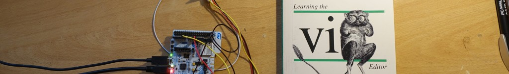
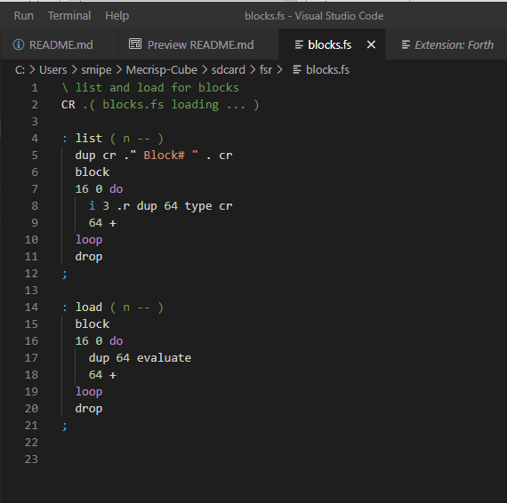

Intro
=====

I was looking for a tiny editor which can be easily adapted and embedded
into a (Forth) system. The [vi EMACS
war](https://en.wikipedia.org/wiki/Editor_war) is over but others have
won. However for me vi is better suited for restricted (embedded)
systems. I have not used [vi](https://en.wikipedia.org/wiki/Vi) for a
very long time, but to see a screen full with ~ at the beginning of the
lines makes me feel like coming home. I never thought I would ever take
the book *Learning the vi Editor*, by Linda Lamb, 5th edition 1990 off
the bookshelf again for reading. I kept the book only for sentimental
reasons.

My editor using history:

-   CP/M Turbo Pascal Editor (Wordstar) OKI if800, Z80 Assembler,
    Pascal, 1984
-   UNIX Rand Editor, Perkin Elmer, 1985
-   VMS EDT MicroVAX, Pascal, Oracle DB, 1987
-   vi ([MKS Toolkit](https://en.wikipedia.org/wiki/MKS_Toolkit)) IBM PC
    DOS cross-assembler for NEC's 75X 4-bit MCUs, Coherent OS, Linux,
    1988
-   UNIX EMACS as system administrator for DEC Tru64 UNIX, SUN Solaris,
    and Linux servers, 1996
-   IDE (Eclipse, NetBeans, EWARM), 2010
-   Atom, VS Code; 2019

Features
========

This vi has its origin in BusyBox tiny vi. But there are some
differences:

-   The program is resident. The text buffer and other buffers too. You
    can leave the program without saving, do some work on the command
    line and go back to vi and continue the edit task.
-   The text buffer is restricted to 40 KiB. Large files have to be
    split up.
-   8-bit characters are allowed e.g. UTF8
-   Mecrisp Forth uses DOS/Windows style line endings carriage return
    and line feed ("\r\n"). Unix (and vi) uses just line feed
    ("\n"). Files are saved as Unix text files.
    <https://vim.fandom.com/wiki/File_format>
-   The command **v** evaluates a line. The command **V** evaluates a
    line and inserts the results into the text buffer.
-   :<line\> evaluates the line and put the result to the status line

Don't forget: you can't use any special keys (e.g. cursor movement
keys) in the insert/replace mode. TABs are forbidden too, Mecrisp can't
handle TABs.

Documentation, Manual
=====================

There are plenty of documents about vi:

-   Busybox vi tutorial <https://k.japko.eu/busybox-vi-tutorial.html>
-   Learning the vi Editor/BusyBox vi
    <https://en.wikibooks.org/wiki/Learning_the_vi_Editor/BusyBox_vi>
-   Unix/Linux - The vi Editor Tutorial
    <https://www.tutorialspoint.com/unix/unix-vi-editor.htm>
-   vi Editor \"Cheat Sheet\"
    <http://www.atmos.albany.edu/daes/atmclasses/atm350/vi_cheat_sheet.pdf>
-   The Vi Lovers Home Page \... this makes a great starting point.
    <https://thomer.com/vi/vi.html>
-   [Learning the vi Editor, by Linda
    Lamb](https://doc.lagout.org/operating%20system%20/linux/Learning%20the%20vi%20and%20Vim%20Editors%2C%207e.pdf)

BusyBox and ToyBox
------------------

-   <https://git.busybox.net/busybox/plain/editors/vi.c>
-   [Toybox](https://en.wikipedia.org/wiki/Toybox)
-   <https://github.com/landley/toybox/blob/master/toys/pending/vi.c>

Usage
=====

    vi [-R] [-h] [-c COLUMNS] [-r ROWS] [FILE..]
       -h show features
       -R Read-only mode. You can still edit the buffer, but will be prevented from overwriting a file.
       -e erase the text buffer
       -c COLUMNS screen columns, range 40..128 default 80
       -r ROWS screen rows, range 16..30 default 24

    vi ( "line<EOL>" -- )  a (Forth) programmer's text editor

Full-fledged Editors
====================

Emacs, Vim, Atom, Visual Studio Code.

Visual Studio Code with
[Forth](https://marketplace.visualstudio.com/items?itemName=fttx.language-forth)
extension:

