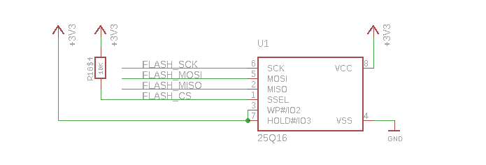
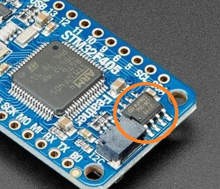
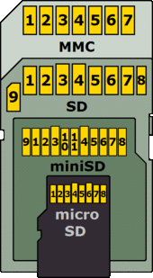
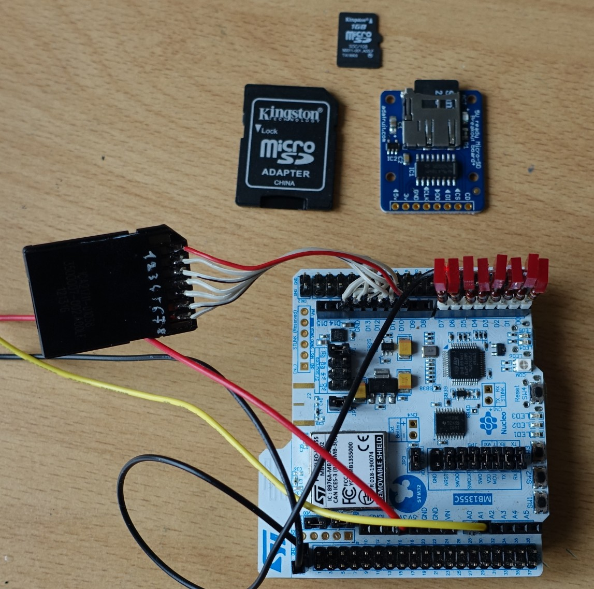
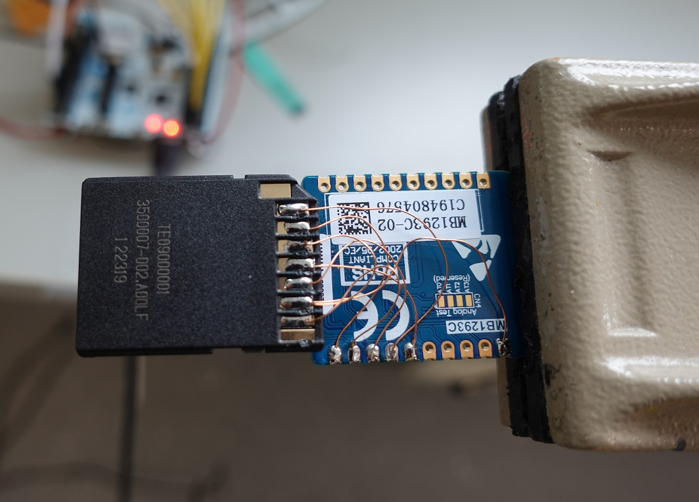
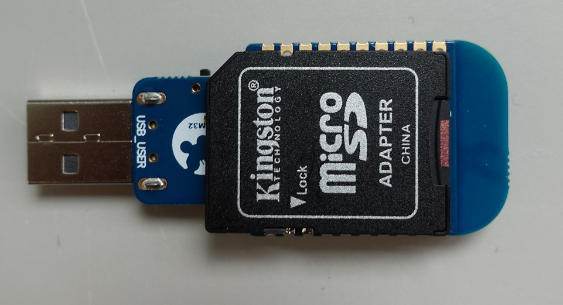
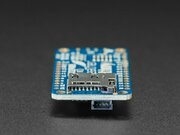

microSD and internal Flash Mass Storage for Blockheads and Fatties
==================================================================

Raw blocks or filesystem? A real filesystem is hefty and several times larger than
the Forth kernel itself. But if you really want to exchange data with
other systems, you need some sort of compatible storage medium like a
microSD with a FAT filesystem. Or if you want to use your embedded
system as a stand-alone development system and save the source code.

For a stand-alone Forth system, especially a embedded system, a block
storage (on internal Flash or external Media) or no mass storage at all
fill the bill.

# FAT Filesystem

FAT is the de-facto standard for embedded systems and mobile devices.
The FAT filesystem for Mecrisp-Cube is based on [FatFs - Generic FAT
Filesystem Module](http://elm-chan.org/fsw/ff/00index_e.html) and
supports FAT (12, 16, and 32) and exFAT formatted SD cards.


## Basic FS Words

[Forth source files](https://www.complang.tuwien.ac.at/forth/gforth/Docs-html/Forth-source-files.html#Forth-source-files).
I propose `.fs` extension for Forth source files the same as GForth
does. But anyway you can use what you want (`.f`, `.4th`, `.fth`, etc).
<pre>
include   ( i*x "name" -- j*x )      Interprets the content of the file "name" 
included  ( i*x c-addr u -- j*x )    Interprets the content of the file.

coredump  ( "name" -- )      Dumps the flash memory (core) into the file "name"

fs-emit   ( c -- )           Emits a character c to a file (stdout)
fs-emit?  ( -- ? )           Ready to send a character to a file (stdout)
fs-key    ( -- c )           Waits for and fetches a character from file. <0 for EOF or error. (stdin)
fs-key?   ( -- ? )           Checks if a character is remaining (stdin)
</pre>

[user variables](CmsisRtos.md#user-variables) which contain a file desciptor 
(pointer address a- to file object structure).
<pre>
stdin     ( -- a- )          for fs-emit and fs-emit?
stdout    ( -- a- )          for fs-key and fs-key?
stderr    ( -- a- )          not used yet
</pre>

Words from [redirection.fs](../fsr/redirection.fs). 
Redirection for the words `emit`, `emit?`, `key`, and `key?`.
You can use the core words like `type` (and other 
[string formating](words.md#string-formatting))
to write to other devices like OLED, LCD, file etc.  
```
>f_open   ( a1 a2 -- ior )   open a file a1 to redirect to a2 (emit, type, ...)
>>f_open  ( a1 a2 -- ior )   open a file to redirect to (emit, type, ...). Append to file
>file     ( -- a1 a2 )       redirect to a file (emit, type, ...)
>f_close  ( -- ior )         close redirection to file 
<f_open   ( a1 a2 -- ior )   open a file to redirect from (key, accept, ...)
<file     ( -- a1 a2)        redirection from a file (key, accept, ...)
<f_close  ( -- ior )         close redirection from file 

>term     ( a1 a2 -- )       terminate to-file redirection
<term     ( a1 a2 -- )       terminate from-file redirection
<>term    ( a1 a2 a3 a4 -- ) terminate redirection

>uart     ( -- a1 a2 )       redirection to uart
<uart     ( -- a1 a2 )       redirection from uart (key, accept, ...)
<>uart    ( -- a1 a2 a3 a4 ) redirection from and to uart

>cdc      ( -- a1 a2 )       redirection to cdc (USB serial)
<cdc      ( -- a1 a2 )       redirection from cdc (key, accept, ...)
<>cdc     ( -- a1 a2 a3 a4 ) redirection from and to cdc

>crs      ( -- a1 a2 )       redirection to crs (BLE serial)
<crs      ( -- a1 a2 )       redirection from crs(key, accept, ...)
<>crs     ( -- a1 a2 a3 a4 ) redirection from and to crs

>oled     ( -- a1 a2 )       redirection to OLED
>lcd      ( -- a1 a2 )       redirection to LCD

>plex     ( -- a1 a2 )       redirection to plex LED display
```

Words from [conditional.fs](../fsr/conditional.fs). 
See also https://forth-standard.org/standard/tools.

`query` not working in include! All the conditionals have to be on the same line.
<pre>
[IF]        ( flag | flag "<spaces>name ..." -- )  If flag is true, do nothing. Otherwise parse and discard words from the parse area 
[ELSE]      ( "<spaces>name ..." -- )              Parse and discard words from the parse area
[THEN]      ( -- )                                 Does nothing. [THEN] is an immediate word. 
[ENDIF]     ( -- )                                 Does nothing. [ENDIF] is an immediate word. 
[IFDEF]     ( "<spaces>name ..." -- )              If the name can be found, do nothing. Otherwise parse and discard words from the parse area
[IFNDEF]    ( "<spaces>name ..." -- )              If the name can´t be found, do nothing. Otherwise parse and discard words from the parse area
[DEFINED]   ( "<spaces>name ..." -- flag )         Return a true flag if name is the name of a word that can be found
[UNDEFINED] ( "<spaces>name ..." -- flag )         Return a false flag if name is the name of a word that can be found
</pre>


## Filesystem API

The API is the same as the 
[FatFs - Generic FAT Filesystem Module](http://elm-chan.org/fsw/ff/00index_e.html). 
It is different from the optional File-Access word set proposed in https://forth-standard.org/standard/file.
<blockquote>
<pre>
OPEN-FILE ( c-addr u fam -- fileid ior )
</pre>
  
Open the file named in the character string specified by _c-addr_ _u_, with file access method indicated by _fam_. The meaning of values of _fam_ is implementation defined.

If the file is successfully opened, _ior_ is zero, _fileid_ is its identifier, and the file has been positioned to the start of the file.

Otherwise, _ior_ is the implementation-defined I/O result code and _fileid_ is undefined.
</blockquote>

The C function prototype for `f_open` looks like this:
```C
FRESULT f_open (
  FIL* fp,           /* [OUT] Pointer to the file object structure */
  const TCHAR* path, /* [IN] File name */
  BYTE mode          /* [IN] Mode flags */
);
```

The parameter order for the Forth Word is the same: `addr1` is address
of the file object data structure
[FIL](http://elm-chan.org/fsw/ff/doc/sfile.html), `addr2` is the address
of the filename array (0 terminated string).
```
f_open  ( addr1 addr2 b -- n )   opens a file.
```

The FIL data structure can be created as follows:
<pre>
create fil /FIL allot[RET]<b> ok.</b>
</pre>

See also [f_open](http://elm-chan.org/fsw/ff/doc/open.html).

Print current directory:
<pre>
256 buffer: path[RET]<b> ok.</b>
path 256 f_getcwd drop strlen type[RET]<b> / ok.</b>
</pre>

or easier with unix like command pwd:
<pre>
pwd[RET]
<b>0:/ ok.</b>
</pre>

Change current directory
<pre>
path 256 accept[RET] common[RET]<b>  ok.</b>
path swap 2dup str0term drop f_chdir .[RET]<b> 0 ok.</b>
pwd[RET]
<b>0:/common ok.</b>
path dup .str" /fsr" f_chdir .[RET]<b> 0 ok.</b>
pwd[RET]
<b>0:/fsr ok.</b>
</pre>

Change drive (if you have a microSD connected):
<pre>
chdrv 1:[RET]
<b>ok.</b>
pwd[RET]
<b>1:/ ok.</b>
cd home[RET]
<b>ok.</b>
pwd[RET]
<b>1:/home ok.</b>
0:[RET]<b> ok.</b> 
pwd[RET]
<b>0:/fsr ok.</b>
</pre>

### Data Structures

#### FATFS

Only used in `FS_init()`. We have only one drive. For details see
[FATFS](http://elm-chan.org/fsw/ff/doc/sfatfs.html)

    /FATFS ( -- u )   Gets the FATFS structure size

#### FIL

For details see [FIL](http://elm-chan.org/fsw/ff/doc/sfile.html).

    /FIL              ( -- u ) Gets the FIL structure size

    FA_READ           ( -- u ) Gets the Mode Flag FA_READ
    FA_WRITE          ( -- u ) Gets the Mode Flag FA_WRITE
    FA_OPEN_EXISTING  ( -- u ) Gets the Mode Flag FA_OPEN_EXISTING
    FA_CREATE_NEW     ( -- u ) Gets the Mode Flag FA_CREATE_NEW
    FA_CREATE_ALWAYS  ( -- u ) Gets the Mode Flag FA_CREATE_ALWAYS
    A_OPEN_ALWAYS     ( -- u ) Gets the Mode Flag FA_OPEN_ALWAYS
    FA_OPEN_APPEND    ( -- u ) Gets the Mode Flag FA_OPEN_APPEND

| POSIX   | FatFs                                   |
|---------|-----------------------------------------|
| "r"     | FA_READ                                 |
| "r+"    | FA_READ FA_WRITE or                     |
| "w"     | FA_CREATE_ALWAYS FA_WRITE or            |
| "w+"    | FA_CREATE_ALWAYS FA_WRITE or FA_READ or |
| "a"     | FA_OPEN_APPEND FA_WRITE or              |
| "a+"    | FA_OPEN_APPEND FA_WRITE or FA_READ or   |
| "wx"    | FA_CREATE_NEW FA_WRITE or               |
| "w+x"   | FA_CREATE_NEW or FA_WRITE FA_READ or    |

#### DIR

For details see [DIR](http://elm-chan.org/fsw/ff/doc/sdir.html).

    /DIR         ( -- u ) Gets the DIR structure size

#### FILINFO

For details see
[FILINFO](http://elm-chan.org/fsw/ff/doc/sfileinfo.html).

    /FILINFO     ( -- u ) Gets the FILINFO structure size

    fsize+       ( -- u ) Gets the FILINFO structure fsize offset
    fdate+       ( -- u ) Gets the FILINFO structure fdate offset
    ftime+       ( -- u ) Gets the FILINFO structure ftime offset
    fattrib+     ( -- u ) Gets the FILINFO structure fattrib offset
    fname+       ( -- u ) Gets the FILINFO structure fname offset
    altname+     ( -- u ) Gets the FILINFO structure altname offset


### File Access Functions/Words

-   [f_open](http://elm-chan.org/fsw/ff/doc/open.html) - Open/Create a
    file
-   [f_close](http://elm-chan.org/fsw/ff/doc/close.html) - Close an open
    file
-   [f_read](http://elm-chan.org/fsw/ff/doc/read.html) - Read data from
    the file
-   [f_write](http://elm-chan.org/fsw/ff/doc/write.html) - Write data to
    the file
-   [f_lseek](http://elm-chan.org/fsw/ff/doc/lseek.html) - Move
    read/write pointer, Expand size
-   [f_truncate](http://elm-chan.org/fsw/ff/doc/truncate.html) -
    Truncate file size
-   [f_sync](http://elm-chan.org/fsw/ff/doc/sync.html) - Flush cached
    data
-   [f_forward](http://elm-chan.org/fsw/ff/doc/forward.html) - Forward
    data to the stream
-   [f_expand](http://elm-chan.org/fsw/ff/doc/expand.html) - Allocate a
    contiguous block to the file
-   [f_gets](http://elm-chan.org/fsw/ff/doc/gets.html) - Read a string
-   [f_putc](http://elm-chan.org/fsw/ff/doc/putc.html) - Write a
    character
-   [f_puts](http://elm-chan.org/fsw/ff/doc/puts.html) - Write a string
-   [f_printf](http://elm-chan.org/fsw/ff/doc/printf.html) - (Write a
    formatted string)
-   [f_tell](http://elm-chan.org/fsw/ff/doc/tell.html) - (Get current
    read/write pointer)
-   [f_eof](http://elm-chan.org/fsw/ff/doc/eof.html) - Test for
    end-of-file
-   [f_size](http://elm-chan.org/fsw/ff/doc/size.html) - Get size
-   [f_error](http://elm-chan.org/fsw/ff/doc/error.html) - Test for an
    error


### Directory Access Functions/Words

-   [f_opendir](http://elm-chan.org/fsw/ff/doc/opendir.html) - Open a
    directory
-   [f_closedir](http://elm-chan.org/fsw/ff/doc/closedir.html) - Close
    an open directory
-   [f_readdir](http://elm-chan.org/fsw/ff/doc/readdir.html) - Read a
    directory item
-   [f_findfirst](http://elm-chan.org/fsw/ff/doc/findfirst.html) - Open
    a directory and read the first item matched
-   [f_findnext](http://elm-chan.org/fsw/ff/doc/findnext.html) - Read a
    next item matched

### File and Directory Management Functions/Words

-   [f_stat](http://elm-chan.org/fsw/ff/doc/stat.html) - Check existance
    of a file or sub-directory
-   [f_unlink](http://elm-chan.org/fsw/ff/doc/unlink.html) - Remove a
    file or sub-directory
-   [f_rename](http://elm-chan.org/fsw/ff/doc/rename.html) - Rename/Move
    a file or sub-directory
-   [f_chmod](http://elm-chan.org/fsw/ff/doc/chmod.html) - Change
    attribute of a file or sub-directory
-   [f_utime](http://elm-chan.org/fsw/ff/doc/utime.html) - Change
    timestamp of a file or sub-directory
-   [f_mkdir](http://elm-chan.org/fsw/ff/doc/mkdir.html) - Create a
    sub-directory
-   [f_chdir](http://elm-chan.org/fsw/ff/doc/chdir.html) - Change
    current directory
-   [f_chdrive](http://elm-chan.org/fsw/ff/doc/chdrive) - Change current
    drive
-   [f_getcwd](http://elm-chan.org/fsw/ff/doc/getcwd.html) - Retrieve
    the current directory and drive

### Volume Management and System Configuration Functions/Words

-   [f_mount](http://elm-chan.org/fsw/ff/doc/mount.html) -
    Register/Unregister the work area of the volume
-   [f_mkfs](http://elm-chan.org/fsw/ff/doc/mkfs.html) - Create an FAT
    volume on the logical drive
-   [f_fdisk](http://elm-chan.org/fsw/ff/doc/fdisk.html) - (Create
    partitions on the physical drive)
-   [f_getfree](http://elm-chan.org/fsw/ff/doc/getfree.html) - Get free
    space on the volume
-   [f_getlabel ](http://elm-chan.org/fsw/ff/doc/getlabel.html)- Get
    volume label
-   [f_setlabel](http://elm-chan.org/fsw/ff/doc/setlabel.html)- Set
    volume label


## UNIX like Shell Commands

Do not expect real UNIX commands not even comparable to the Busybox
commands. The UNIX like shell commands are parsing words. The parameters
are parsed from the input stream till the end of line. These commands
are not intended to use in other words, they are used in the interpreter
mode, use `f_` words in compiler mode. Spaces in path und file names are
not allowed. Verly limited wildcards (only \* and ?) for `ls`. No
standard input/ouptut/err redirection.

### Shell Prompt

```forth
: init ;

: prompt ( -- ) 
  begin 
    tib 256 f_getcwd drop strlen type \ show current working directory
    ."  > "    \ show ">" for prompt. Could show "OK."
    query interpret cr 
  again
;
     
: init init ['] prompt hook-quit ! ; \ make new prompt 
     
init quit
```

### Forth String to 0-Terminated String and vice versa

Caution! There must be space for the 0 character at the end of the
string.
```forth
: str0term ( cadr len -- cadr len )
  + 0 swap c!
;

strlen ( cadr -- cadr len )  \ 0-Terminated String to Forth String
```

### Commands

- **ls** [-a] [-l] [-1] [FILE]  
-a show hidden files  
-l use a long listing format  
-1 list one file per line  
ls ( "line<EOL>" -- ) list directory contents 

- **pwd**  
pwd ( -- ) print name of current/working directory 

- **cd** [DIR]  
cd ( "line<EOL>" -- ) change the working directory 

- **cat** [-n] [> NEWFILE] [>> FILE] [<< EOF] FILES...  
-n line numbers  
\> redirect output to NEWFILE  
\>> redirect output and append to FILE  
<< redirect input till EOF  
cat ( "line<EOL>" -- ) concatenate files and print on the console

- **mkdir** [DIR]...  
mkdir ( "line<EOL>" -- ) make directories

- **rm** FILE...  
rm ( "line<EOL>" -- ) remove files or directories

- **mv** SOURCE DEST  
mv ( "line<EOL>" -- ) move (rename) files

- **cp** SOURCE DEST  
cp ( "line<EOL>" -- ) copy files 

- **chmod** [-a] [+l] [=1] FILE...  
-rwa selected file mode bits removed  
+rwa selected file mode bits added  
=rwa selected file mode bits  
chmod ( "line<EOL>" -- ) change file mode bits

- **touch** [-c] FILE...  
-c do not create any files  
A FILE argument that does not exist is created empty.  
touch ( "line<EOL>" -- ) change file timestamps 

- **df** [VOLUME]  
df ( "line<EOL>" -- ) report file system disk space usage (1 KiB
blocks) 

- **du** [-h] [FILE]  
-h print sizes in powers of 1024 (e.g., 1023 MiB)  
du ( "line<EOL>" -- ) estimate file space usage 

- **vol** [-d NUMBER] [-n NAME]  
-d drive number  
-n change drive name to NAME  
vol ( "line<EOL>" -- ) get and set volume label 

- **mount** [VOLUME]  
mount ( -- ) mount default drive

- **umount** [VOLUME]  
mount ( -- ) unmount default drive 

- **vi** [-R] [-h] [-c <COLUMNS>] [-r <ROWS>] [FILE]  
-h show features   
-R Read-only mode. You can still edit the buffer, but will be prevented from overwriting a file.  
-e erase the text buffer  
-c <COLUMNS> screen columns, range 40..128 default 80  
-r <ROWS> screen rows, range 16..30 default 24  
vi ( "line<EOL>" -- ) a (Forth) programmer's text editor 

- **split** [-l NUMBER] FILE  
-l NUMBER put NUMBER lines/records per output fileline numbers (default 1000 lines)  
suffix length is only 1, generated file names are like this: xa, xb, xc, ...  
split ( "line<EOL>" -- ) split a file into pieces

- **wc** FILE...  
wc ( "line<EOL>" -- ) Word count, print newline, word, and byte counts for each file

- **mkfs**  [VOLUME]  

-   less
-   fdisk
-   dd
-   date
-   ps -> .threads
-   kill


## C-String Helpers

Middleware like FatFs and RTOS expect C strings (see [null-terminated
string](https://en.wikipedia.org/wiki/Null-terminated_string)). In
Forth, the preferred representation of strings on the stack is
`c-addr u-count`, where `c-addr` is the address of the first character
and `u-count` is the number of characters in the string.

    str0term     ( c-addr len -- )          make Forth string null-terminated, be sure the buffer is long enough to accept an additional 0 character.
    strlen       ( c-addr -- c-addr len )   calculate the length of a C string, Forth string compatible
    .str"        ( c-addr "text" --  )      copy string into buffer
    s0"          ( "text" -- c-addr len )   Compiles a 0-terminated string and gives back its address and length when executed
    .(           ( "text) --  )             Mecrisp's ." is working only in compile mode

Hardware
========

Flash Drive
-----------

### Built-in Flash

The built-in flash (STM32WB55C has 1 MiB FLASH, page size 4 KiB) 
can be used as a flash drive. 
No additional hardware is needed. 
384 KiB is about the same as the old DD 5 1/4" floppy from 1978 had. 
The STM32F403 has also 1 MiB flash, but most sectors are 128 KiB, 
and the built-in flash is therefore not suitable for a flash drive.

_Flash Memory Layout_
<pre>
FLASH (rx)                 : ORIGIN = 0x08000000, LENGTH = 256K
   20 KiB Forth Core
   140 KiB Middleware (debug 210 KiB)

FLASH_FORTH (rx)           : ORIGIN = 0x08040000, LENGTH = 128K
   128 KiB Flash Dictionary

FLASH_DRIVE (rx)           : ORIGIN = 0x08060000, LENGTH = 384K
   384 KiB future use for built in flash drive

FLASH_BLESTACK (rx)        : ORIGIN = 0x080C0000, LENGTH = 256K
</pre>

   * [fd.c](/peripherals/fd.c)
   * [flash.c](/peripherals/flash.c)

Create a 384 KiB FAT filesystem as a loop device on Linux 
(or use the already prepared [fd-384k.img](../boot/fd-384k.img)):
<pre>
$ dd if=/dev/zero of=fd-384k.img bs=512 count=768
768+0 Datensätze ein
768+0 Datensätze aus
393216 bytes (393 kB, 384 KiB) copied, 0,00155426 s, 253 MB/s
# losetup /dev/loop1 fd-384k.img
# mkfs -t vfat /dev/loop1
# mount -o loop /dev/loop1 /mnt
</pre>

Copy the the files and directories with `cp` or `tar` to the mounted image, e.g.
<pre>
# cd sdcard
# tar cf - etc fsr home man README.md | tar xvf - -C /mnt
# umount /mnt
</pre>

Umount the loop-device and copy the file to a SD-card. 

Copy the filesystem to the flash disk on the target Mecrisp-Cube system:
<pre>
dd 1:/boot/fd-384k.img 0:
</pre>


### Serial Flash 

#### STM32F405 Feather (SPI W25Q16)

The STM32F405 Feather has a 2 MiB Serial Flash 
[W25Q16](https://www.mouser.ch/datasheet/2/949/w25q16jv_spi_revg_03222018_plus-1489727.pdf) 
on board. The smallest erasable chunk of data is the 4 KiB sector. 
But the default FAT block is 512 Bytes, that means if you want to write 
something to a not erased block, you have to erase the whole sector. 
For this the sector has to be buffered in RAM. For details see:

   * [fd.c](/peripherals/fd.c)
   * [fd_spi.c](/peripherals/fd_spi.c)

You can use the local CLI commands like `mkfs`, `mkdir` and `cp` to populate 
the serial flash with files and directories. 
But this is tedious job because there is no recursive copy. 
It is easier to use a real GNU/Linux for this.

Create a 2 MiB FAT filesystem as a loop device on Linux (or use the already prepared 
[fd-2MiB.img](../boot/fd-2MiB.img)):
<pre>
$ dd if=/dev/zero of=fd-2MiB.img bs=512 count=4096
# losetup /dev/loop1 fd-2MiB.img
# mkfs -t vfat /dev/loop1
# mount -o loop /dev/loop1 /mnt
</pre>

Copy the the files and directories with `cp` or `tar` to the mounted image, e.g.
<pre>
# cd sdcard
# tar cf - etc fsr home man README.md | tar xvf - -C /mnt
</pre>

Umount the loop-device and copy the file to a SD-card. 

Copy the filesystem to the flash disk on the target Mecrisp-Cube F405 system:
<pre>
dd 1:/boot/fd-2MiB.img 0:
</pre>

<table>
  <tr>
    <td></td>
    <td></td>
  </tr>
</table> 

The SST25VF016B seems to be compatible.


#### STM32WB5MM Discovery Kit (QSPI S25FL128)

<blockquote>
16 MiB Quad SPI NOR Flash chip 
[S25FL128SDSMFV001](https://www.cypress.com/file/448601/download). 
Uniform 64-KB sectors with Hybrid 4-KB sectors.
</blockquote>

<blockquote>
The main flash array is divided into erase units called sectors. 
The sectors are organized either as a hybrid combination of 4-KB and 64-KB sectors, 
or as uniform 256-KB sectors. 
</blockquote>

32 4 KiB sectors and 254 64 KiB sectors. What a pain, why use STM this Flash? 
To simplify writing, only the first 4 KiB of the 64 KiB sectors are used. 
That means (32 + 254) * 4 KiB = 1140 KiB are available for the volume. 
To make it even simpler, I use only 64 KiB sectors, 
that means there are 256 sectors and therefore 1 MiB available for the volume. 
For implementation see [fd.c](/peripherals/fd.c) and [fd_spi.c]](/peripherals/fd_spi.c)

Create a 1 MiB FAT filesystem as a loop device on Linux 
(or use the already prepared 
[fd-1MiB.img](../boot/fd-1MiB.img)):
<pre>
$ dd if=/dev/zero of=fd-1MiB.img bs=512 count=2048
# losetup /dev/loop1 fd-1MiB.img
# mkfs -t vfat /dev/loop1
# mount -o loop /dev/loop1 /mnt
</pre>

Copy the the files and directories with `cp` or `tar` to the mounted image, e.g.
<pre>
# cd sdcard
# tar cf - etc fsr home man README.md | tar xvf - -C /mnt
</pre>

Umount the loop-device and copy the file to a SD-card. 

Copy the filesystem to the flash disk on the target Mecrisp-Cube WB5M Discovery system:
<pre>
dd 1:/boot/fd-1MiB.img 0:
</pre>


#### STM32WB Feather (SPI W25Q128)

The [W25Q128JVPIQ](https://www.mouser.ch/datasheet/2/949/w25q128jv_revf_03272018_plus-1489608.pdf). 
There are 4,096 erasable 4 KiB sectors. That means 16 MiB are available for the volume.

Create a 16 MiB FAT filesystem as a loop device on Linux (or use the already prepared 
[fd-16MiB.img](../boot/fd-16MiB.img)):
<pre>
$ dd if=/dev/zero of=fd-16MiB.img bs=512 count=32768
# losetup /dev/loop1 fd-16MiB.img
# mkfs -t vfat /dev/loop1
# mount -o loop /dev/loop1 /mnt
</pre>

Copy the the files and directories with `cp` or `tar` to the mounted image, e.g.
<pre>
# cd sdcard
# tar cf - etc fsr home man README.md | tar xvf - -C /mnt
</pre>

Umount the loop-device and copy the file to a SD-card. 
Copy the filesystem to the flash disk on the target Mecrisp-Cube WB Feather system:
<pre>
dd 1:/boot/fd-16MiB.img 0:
</pre>


#### STM32H743 Nucleo (QSPI W25Q128)

There is no serial NOR flash on board, but there is an QSPI interface on connector CN10.

It is easy to connect a 
[MIKROE-4067](https://www.farnell.com/datasheets/3109361.pdf) or 
[Sparkfun SPX-17115](https://www.sparkfun.com/products/17115) 
with a W25Q128JV (128M-bit) NOR flash memory on it. 
See also [Winbond W25Q128JVPIQ](https://www.mouser.ch/datasheet/2/949/w25q128jv_revf_03272018_plus-1489608.pdf). 

The driver ([fd_spi.c](/H743/peripherals/fd_spi.c), 
[fd.c](/H743/peripherals/fd.c])) 
is based on the STM example project for the 
[N25Q128A](https://www.micron.com/-/media/client/global/documents/products/data-sheet/nor-flash/serial-nor/n25q/n25q_128mb_1_8v_65nm.pdf)

There are 4,096 erasable 4 KiB sectors. That means 16 MiB are available for the volume.

| Name    | Port     | Nucleo     | MIKROE-4067    | SPX-17115   |
|---------|----------|------------|----------------|-------------|
| QS_CS   | PG6      | CN10.13    | CS             | 2 QSPI-CS   |
| QS_CS   | PB10     | CN10.32    | CS             | 2 QSPI-CS   |
| QS_CLK  | PB2      | CN10.15    | CLK            | 3 QSPI-CLK  |
| GND     |          | CN10.17    | GND            | 8 GND       |
| QS_D3   | PD13     | CN10.19    | IO3            | 7 QSPI3     |
| QS_D1   | PD12     | CN10.21    | MISO SDO       | 5 QSPI1     |
| QS_D0   | PD11     | CN10.23    | MOSI SDI       | 4 QSPI0     |
| QS_D2   | PE2      | CN10.25    | IO2            | 6 QSPI2     |
| +3.3V   |          | CN8.7      | +3.3V          | 1 3.3V      |

Copy the filesystem to the flash disk on the target Mecrisp-Cube STM32H743 Nucleo system:
<pre>
dd 1:/boot/fd-16MiB.img 0:
</pre>

See [above](#stm32f405-feather-spi-w25q16) for creating the image `fd-16MiB.img`.


#### Arduino Portenta H7 (QSPI MX25L12833F)

The [Macronix MX25L12833F](https://www.macronix.com/Lists/Datasheet/Attachments/8682/MX25L12833F,%203V,%20128Mb,%20v1.0.pdf) 
is compatible to the Winbond W25Q128JVPIQ. 
See [above](#stm32h743-nucleo-qspi-w25q128) for details.


SD Drive
--------

### Home Brewed microSD Adapter for STM32WB55 Nucleo/Dongle (SPI)

You can build a very cheap microSD adapter by yourself with a microSD to 
SD adapter. You have to solder only 7 wires to a pin header. The 
breakout board for microSD cards from Adafruit have a level shifter, but 
this is not needed because the levels on the Nucleo are already 3.3 V. 
Only the CD pin is missing, this could be handy to detect a microSD 
card.

<table>
  <tr>
    <td></td>
    <td></td>
  </tr>
</table>

| SD pin | microSD pin | Name | Description              | Arduino/Nucleo Pin | Nucleo Dongle |
|--------|-------------|------|--------------------------|--------------------|---------------|
| 1      | 2           | nCS  | Card Select \[CS\]       | D10 (1)            | PB2 CN1.7     |
| 2      | 3           | DI   | Serial Data In \[MOSI\]  | D11 (2)            | PA7 CN1.10    |
| 3      | -           | VSS  | Ground                   | GND (5)            | GND CN1.1     |
| 4      | 4           | VDD  | Power 3.3 V              | 3V3 (6)            | 3V3 CN1.6     |
| 5      | 5           | CLK  | Serial Clock \[SCLK\]    | D13 (4)            | PA5 CN1.8     |
| 6      | 6           | VSS  | Ground                   | GND (5)            | GND CN1.1     |
| 7      | 7           | DO   | Serial Data Out \[MISO\] | D12 (3)            | PA6 CN1.9     |
| 8      | 8           | NC   | Unused                   |                    |               |
| 9      | 1           | NC   | Unused                   |                    |               |

   * http://elm-chan.org/docs/mmc/mmc_e.html
   * https://en.wikipedia.org/wiki/SD_card

Block size 512 Bytes, SPI mode 0 (CPHA=0, CPOL=0), Pull-up on MISO.

<table>
  <tr>
    <td></td>
    <td></td>
  </tr>
</table>

   * https://github.com/spyren/Mecrisp-Cube/master/Forth/Src/sd.c
   * https://github.com/spyren/Mecrisp-Cube/master/Forth/Src/sd_spi.c


### microSD Adapter on STM32F405 Feather (SDIO)

SDIO Interface is well supported by the STM32F405, there is no need to use the slower SPI. 
   * https://github.com/spyren/Mecrisp-Cube/tree/F405/Forth/Src/sd.c

<table>
  <tr>
    <td></td>
    <td></td>
  </tr>
</table>


### Home Brewed microSD Adapter for the STM32H743 Nucleo (SDMMC)

SDIO (SDMMC) Interface is well supported by the STM32H74x, there is no need to use the slower SPI. 
   * https://github.com/spyren/Mecrisp-Cube/tree/H743/Forth/Src/sd.c

| SD pin    | microSD pin     |  Name SPI   | Name SDMMC   | Nucleo Pin CN8   |
|-----------|-----------------|-------------|--------------|------------------|
| 1         | 2               | nCS         | SDIO_D3      | 8                | 
| 2         | 3               | DI          | SDIO_CMD     | 12               |
| 3         | -               | VSS         | GND          | 11               |
| 4         | 4               | VDD         | VDD          | 7                |
| 5         | 5               | CLK         | SDIO_CLK     | 10               |
| 6         | 6               | VSS         | GND          | 11               |
| 7         | 7               | DO          | SDIO_D0      | 2                |
| 8         | 8               | NC          | SDIO_D1      | 4                |
| 9         | 1               | NC          | SDIO_D2      | 6                |


### Home Brewed microSD Adapter for the Feather Boards

| SD pin    | microSD pin     | Name      | Description            | Feather Pin   | 
|-----------|-----------------|-----------|------------------------|---------------|
| 1         | 2               | nCS       | Card Select [CS]       | D10           |
| 2         | 3               | DI        | Serial Data In [MOSI]  | MO (D4)       |
| 3         | -               | VSS       | Ground                 | GND           |
| 4         | 4               | VDD       | Power 3.3 V            | 3V3           |
| 5         | 5               | CLK       | Serial Clock [SCLK]    | SCK (D2)      |
| 6         | 6               | VSS       | Ground                 | GND           |
| 7         | 7               | DO        | Serial Data Out [MISO] | MI (D3)       |
| 8         | 8               | NC        | Unused                 |               |
| 9         | 1               | NC        | Unused                 |               |


JTAG/SWD
--------

| JTAG Pin | JTAG STM 14pin | CN1 Dongle | CN2 Dongle | Description   |
|----------|----------------|------------|------------|---------------|
|          | 1              |            |            | NC            |
|          | 2              |            |            | NC            |
| 1        | 3              | 6          |            | VDD           |
| 2        | 4              | 3          |            | SWDIO         |
| 3        | 5              | 1          |            | GND           |
| 4        | 6              | 4          |            | SWCLK         |
| 5        | 7              | 1          |            | GND           |
| 6        | 8              | 5          |            | SWO           |
| 7        | 9              |            |            | NC            |
| 8        | 10             |            |            | NC            |
| 9        | 11             | 1          |            | GND_DETECT    |
| 10       | 12             | 2          |            | NRST          |
|          | 13             |            | 7 (PB7)    | VCP_RX Target |
|          | 14             |            | 6 (PB6)    | VCP_TX Target |


Raw Blocks
==========

Flash Drive
-----------

The Flash on the STM32WB is divided in 4 KiB pages. For 1 KiB blocks the
other 3 KiB in the page have to be buffered.

SD Drive
--------

One Forth block consists of two microSD sectors. No filesystem is
involved, blocks are mapped direct to the sectors: block_number =
sector_number / 2. Caution! If you write a block on a formatted disk you
will destroy the filesystem. Block 0 for example is the Master Boot
Sector, to overwrite this sector/block would end in a disaster. If you
really want to share blocks and filesystem on the same disk you have to
create an additional partition for the Forth blocks. Or if you only want
to play with some toy blocks, you can abuse the boot loader, because it
is usually not required and you can therefore use blocks from 10 to 100.
But be warned, do not do this on the SD card with the vacation pictures!

The blocks can be used as buffers. As long as you use less or equal than
4 blocks, nothing is stored on the SD card.

Block (Virtual Memory) Words
----------------------------
```
block          ( n -- a )      Return address of buffer for block n. 0 on error.
buffer         ( n -- a )      Return address of buffer for block n. Does not get the block from disk. 0 on error.
empty-buffers  ( -- )          Marks all block buffers as empty.
update         ( -- )          Marks most recent block as updated (dirty).
save-buffers   ( -- )          Transfers the contents of each updated block buffer to disk.
flush          ( -- )          save-buffers empty-buffers
list           ( n -- )        Display block n. The block is displayed as 16 numbered lines, each of 64 characters. 
load           ( n -- )        Interprets the content of block n. 

drive          ( u -- )        Initializes the drive (0 flash drive, 1 SD drive) and makes it current, sets the block count.
#blocks        ( -- n )        Gets the block count from current drive.
```

Block Editor
------------

VI or EMACS keybindings? VI has a line editing mode too, fine for really
dumb terminals.

-   VIBE <https://www.complang.tuwien.ac.at/forth/vibe-2.1ans.fs>
    <http://kestrelcomputer.github.io/kestrel/2016/03/29/vibe-2.2>
-   Standard Mecrisp [block
    editor](https://github.com/spyren/Mecrisp-Cube/blob/master/sdcard/fsr/editor.fs)
-   <https://github.com/larsbrinkhoff/fmacs>

Raw Blocks and GNU/Linux
------------------------

Example 2 GiB microSD FAT16 formatted, show the disk parameter with
fdisk:

    # fdisk /dev/sdf
    ...
    Befehl (m für Hilfe): p
    Festplatte /dev/sdf: 1,91 GiB, 2032664576 Bytes, 3970048 Sektoren
    Festplattenmodell: FCR-HS219/1     
    Einheiten: Sektoren von 1 * 512 = 512 Bytes
    Sektorgröße (logisch/physikalisch): 512 Bytes / 512 Bytes
    E/A-Größe (minimal/optimal): 512 Bytes / 512 Bytes
    Festplattenbezeichnungstyp: dos
    Festplattenbezeichner: 0x00000000

    Gerät      Boot Anfang    Ende Sektoren Größe Kn Typ
    /dev/sdf1          249 3967487  3967239  1,9G  6 FAT16

Fill the SD with zeros (1\'000\'000 sectors à 512 Bytes), that takes
about 5 Minutes:

    # dd if=/dev/zero of=/dev/sdf  count=1000000
    1000000+0 Datensätze ein
    1000000+0 Datensätze aus
    512000000 Bytes (512 MB, 488 MiB) kopiert, 271,43 s, 1,9 MB/s

Write the first block with the famous F example
[letter-f.block](%ATTACHURLPATH%/letter-f.block) from [Starting
Forth](https://www.forth.com/starting-forth/1-forth-stacks-dictionary/),
*Leo Brodie*:

    # dd if=letter-f.block of=/dev/sdf
    2+0 Datensätze ein
    2+0 Datensätze aus
    1024 Bytes (1,0 kB, 1,0 KiB) kopiert, 0,00226272 s, 453 kB/s

Put the microSD card into the SD adapter and startup the Mecrisp-Cube
Nucleo:

    Mecrisp-Cube 1.2.0 for STM32WB55 (C) peter@spyr.ch.
    Based on Mecrisp-Stellaris 2.5.2 by Matthias Koch. 
    0 list 
    Block# 0 
      0 \ Large letter F                                                
      1 : STAR    [CHAR] * EMIT ;                                       
      2 : STARS   0 DO  STAR  LOOP ;                                    
      3 : MARGIN  CR 30 SPACES ;                                        
      4 : BLIP    MARGIN STAR ;                                         
      5 : BAR     MARGIN 5 STARS ;                                      
      6 : F       BAR BLIP BAR BLIP BLIP CR ;                           
      7                                                                 
      8 F                                                               
      9                                                                 
     10                                                                 
     11                                                                 
     12                                                                 
     13                                                                 
     14                                                                 
     15                                                                 
     ok.
    0 load 
                                  *****
                                  *
                                  *****
                                  *
                                  *
     ok.
     ok.
    0 block hex. 200216F8  ok.
    0 block 1200 dump 
    200216F0 :  00 01 00 00 D9 86 03 00   5C 20 4C 61 72 67 65 20  | ........  \ Large  |
    20021700 :  6C 65 74 74 65 72 20 46   20 20 20 20 20 20 20 20  | letter F           |
    20021710 :  20 20 20 20 20 20 20 20   20 20 20 20 20 20 20 20  |                    |
    20021720 :  20 20 20 20 20 20 20 20   20 20 20 20 20 20 20 20  |                    |
    20021730 :  20 20 20 20 20 20 20 20   3A 20 53 54 41 52 20 20  |           : STAR   |
    20021740 :  20 20 5B 43 48 41 52 5D   20 2A 20 45 4D 49 54 20  |   [CHAR]   * EMIT  |
    20021750 :  3B 20 20 20 20 20 20 20   20 20 20 20 20 20 20 20  | ;                  |
    20021760 :  20 20 20 20 20 20 20 20   20 20 20 20 20 20 20 20  |                    |
    20021770 :  20 20 20 20 20 20 20 20   3A 20 53 54 41 52 53 20  |           : STARS  |
    20021780 :  20 20 30 20 44 4F 20 20   53 54 41 52 20 20 4C 4F  |   0 DO    STAR  LO |
    20021790 :  4F 50 20 3B 20 20 20 20   20 20 20 20 20 20 20 20  | OP ;               |
    200217A0 :  20 20 20 20 20 20 20 20   20 20 20 20 20 20 20 20  |                    |
    200217B0 :  20 20 20 20 20 20 20 20   3A 20 4D 41 52 47 49 4E  |           : MARGIN |
    200217C0 :  20 20 43 52 20 33 30 20   53 50 41 43 45 53 20 3B  |   CR 30   SPACES ; |
    200217D0 :  20 20 20 20 20 20 20 20   20 20 20 20 20 20 20 20  |                    |
    200217E0 :  20 20 20 20 20 20 20 20   20 20 20 20 20 20 20 20  |                    |
    200217F0 :  20 20 20 20 20 20 20 20   3A 20 42 4C 49 50 20 20  |           : BLIP   |
    20021800 :  20 20 4D 41 52 47 49 4E   20 53 54 41 52 20 3B 20  |   MARGIN   STAR ;  |
    20021810 :  20 20 20 20 20 20 20 20   20 20 20 20 20 20 20 20  |                    |
    20021820 :  20 20 20 20 20 20 20 20   20 20 20 20 20 20 20 20  |                    |
    20021830 :  20 20 20 20 20 20 20 20   3A 20 42 41 52 20 20 20  |           : BAR    |
    20021840 :  20 20 4D 41 52 47 49 4E   20 35 20 53 54 41 52 53  |   MARGIN   5 STARS |
    20021850 :  20 3B 20 20 20 20 20 20   20 20 20 20 20 20 20 20  |  ;                 |
    20021860 :  20 20 20 20 20 20 20 20   20 20 20 20 20 20 20 20  |                    |
    20021870 :  20 20 20 20 20 20 20 20   3A 20 46 20 20 20 20 20  |           : F      |
    20021880 :  20 20 42 41 52 20 42 4C   49 50 20 42 41 52 20 42  |   BAR BL  IP BAR B |
    20021890 :  4C 49 50 20 42 4C 49 50   20 43 52 20 3B 20 20 20  | LIP BLIP   CR ;    |
    200218A0 :  20 20 20 20 20 20 20 20   20 20 20 20 20 20 20 20  |                    |
    ...
    20021AF0 :  20 20 20 20 20 20 20 20   00 00 00 00 01 00 00 00  |           ........ |
    ...
    20021BB0 :  00 00 00 00 00 00 00 00   00 00 00 00 00 00 00 00  | ........  ........ |
     ok.
