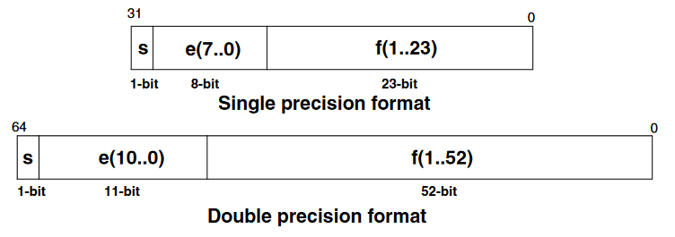
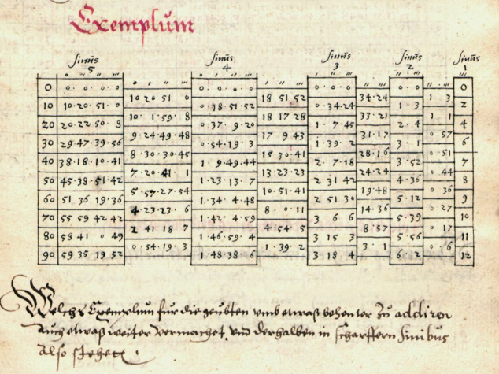

Floating-Point Unit FPU
=======================

Why Floating-Point?
-------------------

[STM AN4044](https://www.st.com/resource/en/application_note/an4044-floating-point-unit-demonstration-on-stm32-microcontrollers-stmicroelectronics.pdf):
> One alternative to floating-point is [fixed-point](https://mecrisp-stellaris-folkdoc.sourceforge.io/fixed-point.html),
> where the exponent field is fixed. But if fixed-point is giving better calculation speed
> on FPU-less processors, the range of numbers and their dynamic is low. As a consequence,
> a developer using the fixed-point technique will have to check carefully any
> scaling/saturation issues in the algorithm. 
>
>| *Coding*         | *Dynamic [dB]* |
>|------------------|----------------|
>| Int32            | 192            |
>| Int64            | 385            |
>| Single precision | 1529           |
>| Double precision | 12318          |

The STM32 ARM Cortex M4F MPUs (e.g. STM32WB, STM32F4, STM32L4) have a single precision floating-point unit. 
The STM32H7 MPUs have a double precision FPU (not supported yet).

Also from STM AN4044

>Floating-point calculations require a lot of resources, as for any operation between
>two numbers. For example, we need to:
>
>    Align the two numbers (have them with the same exponent)
>    Perform the operation
>    Round out the result
>    Code the result 
>
>On an FPU-less processor, all these operations are done by software through the C compiler
>library (or Forth Words) and are not visible to the programmer; but the performances are very low.
>On a processor having an FPU, all of the operations are entirely done by hardware in a single cycle,
>for most of the instructions. The C (or Forth) compiler does not use its own floating-point
>library but directly generates FPU native instructions.
>
>When implementing a mathematical algorithm on a microprocessor having an FPU, the programmer 
>does not have to choose between performance and development time.
>The FPU brings reliability allowing to use directly any generated code through a 
>high level tool, such as MATLAB or Scilab, with the highest level of performance.
>
>Any integer with absolute value less than 2^24 can be exactly represented in the single-precision 
>format, and any integer with absolute value less than 2^53 can be exactly represented in the 
>double-precision format.


## Normalized Numbers Range 

| Mode    | Exponent   | Exp. Bias   | Exp. Range   | Mantissa   | Decimal digits   | Min. value   | Max. Value   |
|---------|------------|-------------|--------------|------------|------------------|--------------|--------------|
| Single  | 8-bit      | 127         |  -126,+127   | 23-bit     | 7.22             | 1.18E-38     | 3.40E38      |
| Double  | 11-bit     | 1023        | -1022,+1023  | 52-bit     | 15.95            | 2.23E-308    | 1.8E308      |


## IEEE.754 Single and Double Precision Floating-Point Coding 

   * [Single-precision floating-point format](https://en.wikipedia.org/wiki/Single-precision_floating-point_format)
   * [Double-precision floating-point format](https://en.wikipedia.org/wiki/Double-precision_floating-point_format)



   * [Scientific notation](https://en.wikipedia.org/wiki/Scientific_notation)
   * [Engineering notation](https://en.wikipedia.org/wiki/Engineering_notation)
   * [Metric prefix](https://en.wikipedia.org/wiki/Metric_prefix)


Floating-Point Words
--------------------

No separate floating-point stack. A single precision floating-point number is one cell. 
The 32-bit base-2 format is officially referred to as binary32 [IEEE 754-2008](https://en.wikipedia.org/wiki/IEEE_754-2008_revision).

### Bare FPU Words (Without C Math Library)

```
f+      ( r1 r2 -- r3 )     Add r1 to r2 giving the sum r3
f-      ( r1 r2 -- r3 )     Subtract r2 from r1, giving r3
f*      ( r1 r2 -- r3 )     Multiply r1 by r2 giving r3
f/      ( r1 r2 -- r3 )     Divide r1 by r2, giving the quotient r3
fsqrt   ( r1 -- r2 )        r2 is the square root of r1

fabs    ( r1 -- r2 )        r2 is the absolute value of r1
fnegate ( r1 -- r2 )        r2 is the negation of r1
fround  ( r1 -- r2 )        round r1 to an integral value using the "round to nearest" rule, giving r2

10**>f  ( n -- r )          raise 10 to the power n, giving product r
flog>n  ( r -- n )          n is the base-ten logarithm of r

fflags@ ( -- u )            get the current value of the Floating Point Status/Control register FPSCR
fflags! ( u -- )            assign the given value to the Floating Point Status/Control register FPSCR

f0=     ( r -- f )          flag is true if r is equal to zero
f0<     ( r -- f )          flag is true if r is less than zero
f<      ( r1 r2 -- f )      flag is true if r1 is less than r2
f~      ( r1 r2 r3 -- f )   If r3 is positive, flag is true if the absolute value of (r1 minus r2) is less than r3
                            If r3 is zero, flag is true if the implementation-dependent encoding of r1 and r2 are exactly identical 
                            (positive and negative zero are unequal if they have distinct encodings).
                            If r3 is negative, flag is true if the absolute value of (r1 minus r2) is less than the absolute value 
                            of r3 times the sum of the absolute values of r1 and r2. 

f>s     ( r -- n )          n is the single-cell signed-integer equivalent of the integer portion of r
s>f     ( n -- r )          r is the floating-point equivalent of the single-cell value n
f>x     ( r -- x )          x is the fixed-point equivalent of the floating-point r
x>f     ( x -- r )          r is the floating-point equivalent of the fixed-point x

pi      (  -- r )           r is pi, approx. 3.14159274101257324
e       (  -- r )           r is e, approx. 2.7182818

fnumber (a # -- r u )       convert the specified string by a and # to float r, on success u is 1, otherwise 0
>float  (a # -- r f )       convert the specified string by a and # to float r, on success flag is true

f.      ( r --  )           display, with a trailing space, the floating-point number r in fixed-point notation
fs.     ( r --  )           display, with a trailing space, the floating-point number r in scientific notation
fe.     ( r --  )           display, with a trailing space, the floating-point number r in engineering notation
fm.     ( r --  )           display, with a trailing space, the floating-point number r in metric unit prefix notation
precision     ( -- u )      return the number of significant digits currently used by f., fs., fe., or fm. as u
set-precision ( u -- )      set the number of significant digits currently used by f., fs., fe., or fm. to u
```


### Words Using the C Math Library

[C mathematical functions](https://en.wikipedia.org/wiki/C_mathematical_functions) @ Wikipedia
```
fsin    ( r1 -- r2 )       r2 is the sine of the radian angle r1
fcos    ( r1 -- r2 )       r2 is the cosine of the radian angle r1
ftan    ( r1 -- r2 )       r2 is the principal radian angle whose tangent is r1
fasin   ( r1 -- r2 )       r2 is the principal radian angle whose sine is r1
facos   ( r1 -- r2 )       r2 is the principal radian angle whose cosine is r1
fatan   ( r1 -- r2 )       r2 is the principal radian angle whose tangent is r1

fsinh   ( r1 -- r2 )       r2 is the hyperbolic sine of r1
fcosh   ( r1 -- r2 )       r2 is the hyperbolic cosine of r1
ftanh   ( r1 -- r2 )       r2 is the hyperbolic tangent of r1
fasinh  ( r1 -- r2 )       r2 is the floating-point value whose hyperbolic sine is r1
facosh  ( r1 -- r2 )       r2 is the floating-point value whose hyperbolic cosine is r1
fatanh  ( r1 -- r2 )       r2 is the floating-point value whose hyperbolic tangent is r1

fceil   ( r1 -- r2 )       return the smallest integral value that is not less than r1
ffloor  ( r1 -- r2 )       Round r1 to an integral value using the "round toward negative infinity" rule, giving r2

fexp    ( r1 -- r2 )       raise e to the power r1, giving r2.
f**     ( r1 r2 -- r3 )    raise r1 to the power r2, giving the product r3

fln     ( r1 -- r2 )       r2 is the natural logarithm of r1
flog    ( r1 -- r2 )       r2 is the base-ten logarithm of r1
```

## How to Use

### Some Hints for Using the FPU

It is better to be approximately (vaguely) right than exactly wrong. Carveth Read

   * Do not use FPU in interrupt service routines.
   * Tasks/Threads with FPU operations need much more return stack depth. 
   * Rounding is not always working properly. Not useful for precision more than 3.

### Examples

<pre>
0.1005e fs. 1.01E-1  ok.
0.1005e fm. 101m ok.
4 set-precision
0.100005e fs. 1.0000E-1  ok.
0.100005e fm. 100.00m ok.
1.00005e f>x x. 1,00004994869232177734375000000000  ok.
1,00005 x. 1,00004999991506338119506835937500  ok.
</pre>


Calculation of two [parallel resistors](https://en.wikipedia.org/wiki/Resistor#Series_and_parallel_resistors):
```forth
: f|| ( r1 r2 -- r3) 
  2dup f* -rot f+ f/ 
;
```

```
27k 100k f|| fm.  21.3k  ok.
```

[RC time constant](https://en.wikipedia.org/wiki/RC_time_constant)
```
2.2n 47k f* fm. 103u  ok.
```


## Performance Estimation

All measurements and calculation are based on the *Cortex !M4F MCU !STM32WB55 @ 32 MHz*.

Simple test program to estimate execution time of `fsin` and `fsqrt`:
<pre>
: test-fpu ( -- n ) \ test 1000 times sin return n in ms
  osKernelGetTickCount  cr
  pi 2e f* 1000e f/  \ 2*pi/1000
  cr
  1000 0 do
\   dup i s>f f*      drop
    dup i s>f f* fsin drop
\   i .  dup i s>f f* fsin fs.   cr
\   i .  dup i s>f f* fsin hex.  cr
  loop
  drop
  osKernelGetTickCount swap -
;
</pre>

With `fsin` it takes about 7 ms, without about 1 ms for 1000 iterations. 
Therefore a `fsin` word takes about 6 us. 
For the *!STM32F405 @ 168 MHz*, the `fsin` takes about 2 us.

`fsqrt` takes also about 2 ms for 1000 iterations. Therefore a `fsqrt` word 
takes about 1 us or less (the same time as `f/`, see below).

Basic operations like `f/` are defined as inline. 
First check `fsin` and `f/` with the builtin disassembler:
<pre>
see fsin
08007BE8: B500  push { lr }
08007BEA: 4630  mov r0 r6
08007BEC: F025  bl  0802D694
08007BEE: FD52
08007BF0: 4606  mov r6 r0
08007BF2: BD00  pop { pc }
 ok.
</pre>

The FPU instructions are unknown to the disassembler
<pre>
see f/
0800745A: EE00
0800745C: 6A90
0800745E: CF40  ldmia r7 { r6 }
08007460: EE00
08007462: 6A10
08007464: EE80
08007466: 0A20
08007468: EE10
0800746A: 6A10
0800746C: 4770  bx lr
</pre>

From [fpu.s](https://github.com/spyren/Mecrisp-Cube/blob/master/Forth/cube/fpu.s) on !GitHub
<pre>
@ -----------------------------------------------------------------------------
        Wortbirne Flag_foldable_2|Flag_inline, "f/"
f_slash:
        @ ( r1 r2 -- r3 ) Divide r1 by r2, giving the quotient r3.
@ -----------------------------------------------------------------------------
	vmov 	s1, tos                      1
	drop               ldmia r7 { r6 }   1
	vmov 	s0, tos                      1
	vdiv.f32 s0, s0, s1                  14
	vmov 	tos, s0                      1
	bx 		lr
                                      cycles 18
</pre>

About 20 cycles (625 ns @ 32 MHz) for a division, 10 (300 ns) for multiplication, 
and 5 (150 ns) for +/-. `vsqrt.f32` has 14 cycles. 

<pre>
include /fsr/fixpt-math-lib.fs  ok.

: test-fix ( -- n ) \ test 1000 times fixed-point sin return n in ms
  osKernelGetTickCount  cr
\ pi 2e f* 1000e f/  \ 2*pi/1000
  360,0 1000,0 x/
  cr
  1000 0 do
\   2dup i 0 swap x*      2drop
\   2dup i 0 swap x* sin  2drop
    2dup i 0 swap x* sqrt  2drop
\   i .  2dup i 0 swap x* sin x.   cr
\   i .  2dup i 0 swap x* sqrt x.   cr
\   i .  2dup i 0 swap x* sin hex. hex. cr
  loop
  2drop
  osKernelGetTickCount swap -
;
test-fix .

323 
</pre>

With `sqrt` it takes about 323 ms (`sin` is not working for me), without about 6 ms. 
Therefore a `sqrt` word takes about 317 us, with FPU it takes less than 1 us. 
A simple multiplication about 6 us (FPU 300 ns). 

Only addition and subtraction are comparable:
<pre>
see d+
080008B6: CF07  ldmia r7 { r0  r1  r2 }   1
080008B8: 1812  adds r2 r2 r0             1
080008BA: 414E  adcs r6 r1                1
080008BC: 3F04  subs r7 #4                1
080008BE: 603A  str r2 [ r7 #0 ]          1
080008C0: 4770  bx lr
                                   Cycles 5

@ -----------------------------------------------------------------------------
        Wortbirne Flag_foldable_2|Flag_inline, "f+"
f_add:
        @ ( r1 r2 -- r3 ) Add r1 to r2 giving the sum r3.
@ -----------------------------------------------------------------------------
	vmov 	s1, tos                   1
	drop                              1
	vmov 	s0, tos                   1
	vadd.f32 s0, s1                   1
	vmov 	tos, s0                   1
	bx 		lr
                                   Cycles 5
</pre>

### Windows PC

*Swift-Forth* on a 64 bit Windows PC @ 3.4 GHz, HW FPU
<pre>
: test ( --  ) \ test 1'000 times sin, displays time in us
  ucounter cr
  pi 2e f* 1000e f/  \ 2*pi/1000
  cr
  1000 0 do
\    fdup i s>f f*      fdrop
     fdup i s>f f* fsin fdrop
\    i .  fdup i s>f f* fsin fs.   cr
\    i .  fdup i s>f f* fsin hex. hex.  cr
  loop
  fdrop
  utimer
;
</pre>

91 us, 28 us -> 63 ns for `fsin`. 2 magnitudes faster than Mecrisp-Cube M4F @ 32 MHz


### Linux PC

*Gforth* on a 64 bit Linux PC @ Intel I7 8 cores 2.2 GHz, HW FPU
<pre>
: test ( --  ) \ test 1'000 times sin, displays time in us
  utime cr
  pi 2e f* 1000e f/  \ 2*pi/1000
  cr
  1000 0 do
\    fdup i s>f f*      fdrop
     fdup i s>f f* fsin fdrop
\    i .  fdup i s>f f* fsin fs.   cr
\    i .  fdup i s>f f* fsin hex. hex.  cr
  loop
  fdrop
  utime 2swap d-
;
</pre>
64 us, 13 us -> 51 ns for `fsin`. 2 magnitudes faster than Mecrisp-Cube M4F @ 32 MHz


### Conclusion

As long as you do only elementary arithmetic, fixed- and floating-point have 
comparable execution time (but division and multiplication is a magnitude slower). 
But for more elaborate calculation (trigonomteric, exponential functions) the 
execution time is for fixed-point at least two magnitudes slower.

If time is not an issue in either development or execution, you can easily do without the FPU.


## Varia

### Implementation Details


   * [fpu.s](https://github.com/spyren/Mecrisp-Cube/blob/master/Forth/cube/fpu.s) on GitHub
   * [fpu.c](https://github.com/spyren/Mecrisp-Cube/blob/master/peripherals/fpu.c) on GitHub

Mecrisp-Cube has the word `f.` defined as an assembler routine in 
[fpu.s](https://github.com/spyren/Mecrisp-Cube/blob/master/Forth/cube/fpu.s), 
but the example here is written in Forth. I use a dot for the 
[decimal separator](https://en.wikipedia.org/wiki/Decimal_separator). 
[Terry Porter](https://mecrisp-stellaris-folkdoc.sourceforge.io/fixed-point.html) 
"because those crazy Europeans use a comma instead of a decimal point". 
Not all europeans are crazy, at least the Swiss are an exception ;-), 
they use sometimes decimal points. 

```forth
: f. ( r -- )  \ display, with a trailing space, the floating-point number r in fixed-point notation
  dup  f0< if
    45 emit 
    fabs
  then
  dup
  $3F000000 \ .5
  precision 0 do
    $41200000 f/ \ 10.0 / 
  loop
  f+            \ round
  f>x
  <# 
    0 #s 2drop    \ integer part
    46 hold<       \ decimal point
    precision 0 do
      x#             \ fract digit
    loop
   dup
  #>
  type space
; 
```

### Jost Bürgi

http://wp.andreas.bieri.name/myblog/2018/01/30/jost-buergis-sinus-berechnung/


### Links

   * https://forth-standard.org/standard/float
   * https://en.wikipedia.org/wiki/IEEE_754 
   * https://en.wikipedia.org/wiki/Single-precision_floating-point_format
   * [What Every Computer Scientist Should Know About Floating-Point Arithmetic](https://docs.oracle.com/cd/E19957-01/806-3568/ncg_goldberg.html)
   * [Fixed Point](https://mecrisp-stellaris-folkdoc.sourceforge.io/fixed-point.html), https://en.wikipedia.org/wiki/Q_(number_format)

   * https://www.complang.tuwien.ac.at/forth/gforth/Docs-html/Number-Conversion.html#Number-Conversion
   * https://www.complang.tuwien.ac.at/forth/gforth/Docs-html/Floating-Point.html#Floating-Point
   * https://forth-standard.org/proposals/recognizer#contribution-142
   * https://interrupt.memfault.com/blog/cortex-m-rtos-context-switching ARM Cortex-M RTOS Context Switching
   * https://mcuoneclipse.com/2019/03/29/be-aware-floating-point-operations-on-arm-cortex-m4f/
   * http://support.raisonance.com/content/how-should-i-use-floating-point-unit-fpu-cortex-m4
   * [Newlib](https://en.wikipedia.org/wiki/Newlib)
   * [The Forth Scientific Library](https://www.taygeta.com/fsl/scilib.html) e.g. for ANS Forth Complex Arithmetic Lexicon


